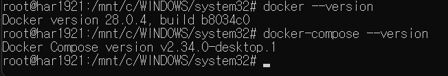
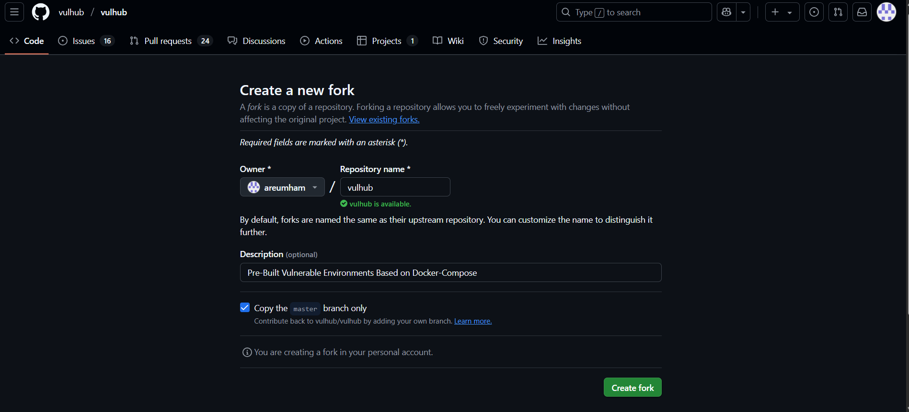
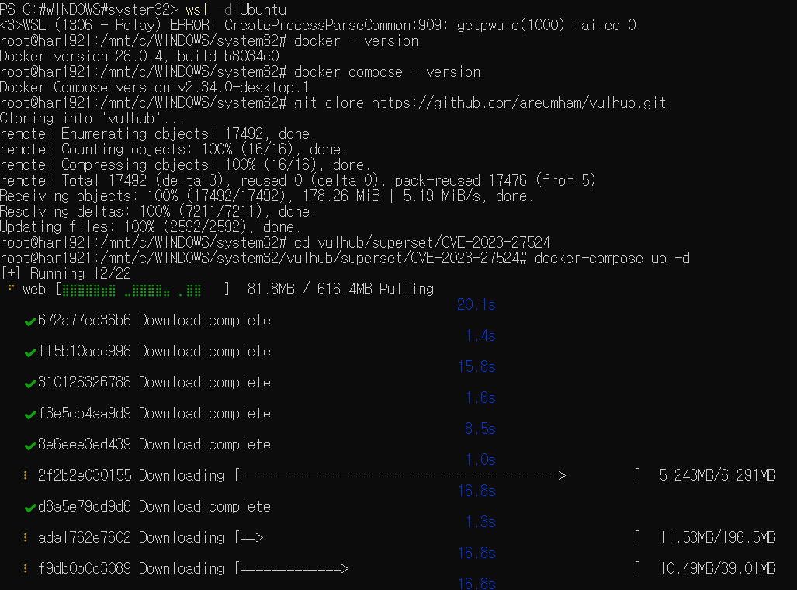
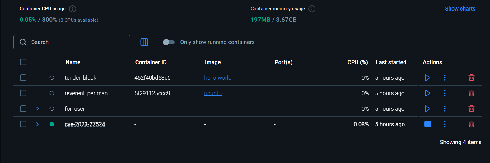
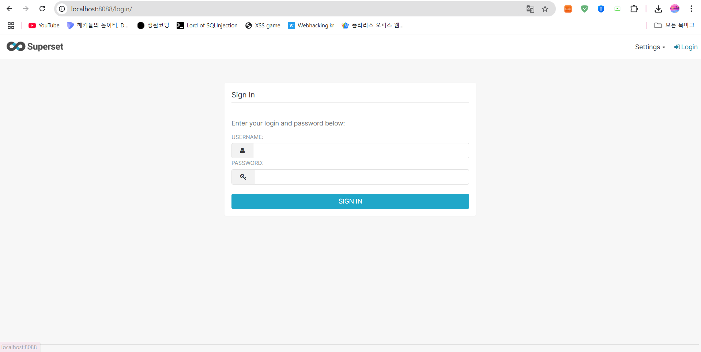
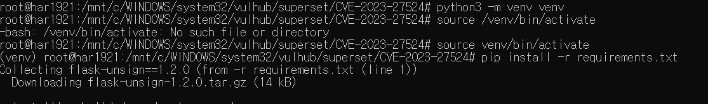
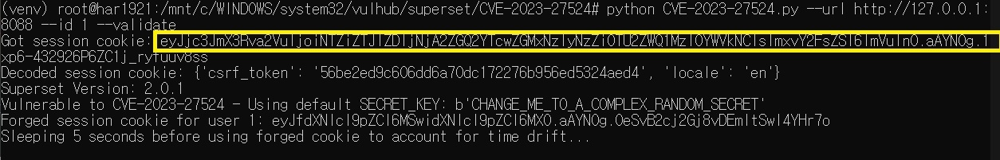
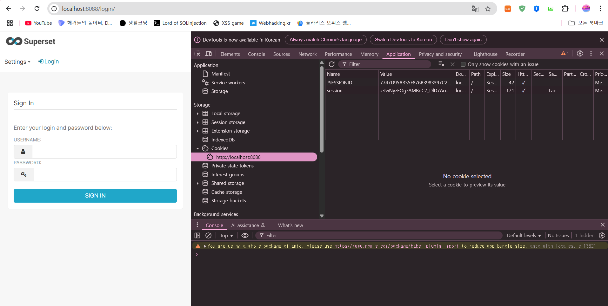
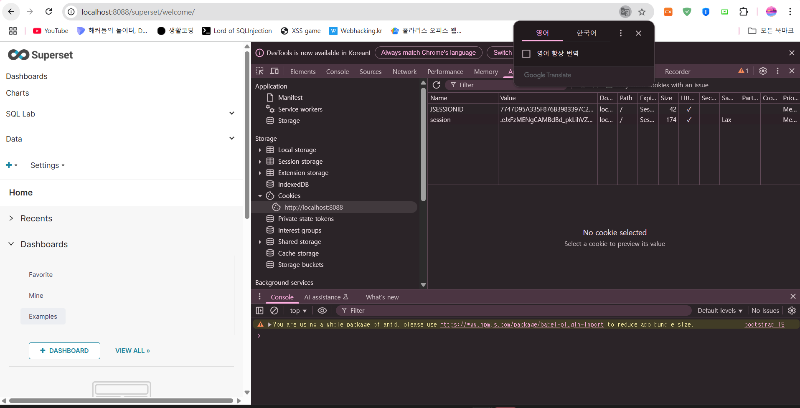

<<<<<<< HEAD
# CVE-2023-27524 취약점 분석 및 실습 보고서

1. 개요
2. 실습 환경 구성
3. 환경 설정
4. 취약점 개요 및 공격 흐름
5. 결론

1. 개요
Apache Superset은 시각적이고 대화형으로 설계된 오픈 소스 데이터 탐색 및 시각화 플랫폼이다. 본 보고서에서 다루는 CVE-2023-27524는 superset에  하드코딩된 JWT 비밀 키(CVE-2023-27524)로 인해 발생하는 인증 우회 취약점이다.이 취약점은 superset이 기본 키를 변경하지 않은 채 운영될 경우, 공격자가 유효한 세션 쿠기를 위조하여 관리자 권한을 탈취할 수 있는 문제이다. 이를 통해 대시보드 및 연결된 데이터베이스에 무단 접근할 수 있으며, 심각한 경우 원격 코드 실행(RCE)로 이어질 수 있다.
또한, 해당 취약점은 CVE-2023-37941과 결합될 경우 역직렬화 취약점을 통한 원격 코드 실행이 가능해지는 등, 공격의 위협이 증대된다.

🔗 출처:

https://nvd.nist.gov/vuln/detail/CVE-2023-27524

https://github.com/vulhub/vulhub/tree/master/superset/CVE-2023-27524

2. 실습환경 구성
- CVE 번호 : CVE-2023-27524
- 대상 애플리케이션 : Apache Superset
- 실습 목적 : CVE 환경을 Docker로 구성하고, 인증 우회 취약점 PoC를 실행하여  관리자 세션 탈취 과정을 검증한다.
- 도구 및 버전
    - OS : Ubuntu 20.04 (WSL2 사용)
    - Docker version : 28.0.4
    - docker-compose version : 2.34
    

2. 환경 설정

2-1 vulhub Fork
링크 : https://github.com/gunh0/kr-vulhub

vulhub 레포지토리를 자신의 GitHub 계정으로 Fork한 후, 해당 레포지토리에서 작업을 진행하였다.

2-2 docker wsl과 연결
wsl과 연결해주고, 취약한 Apache Superset 이미지를 실행시켜준다.
cd vulhub/superset/CVE-2023-27524
docker-compose up -d
를 실행해준다.

docker desktop과 잘 연결됨을 볼 수 있다.

2-3 컨테이너 및 포트 확인
Docker Desktop 컨테이너가 정상 실행되었는지 확인하고, 브라우저로 접속한다.

브라우저에 접속하기 위해 포트번호를 확인하고 접속한다.
필자의 포트는 8088로 http://127.0.0.1:8080로 접속한다

접속이 완료됨을 보여준다.
이것이 뜻하는 바는 세션 쿠키를 위조하여 Superset에 로그인하는 과정은, 해당 취약점이 인증 우회 가능하다는 것을 보여준다. 별도의 사용자 계정 없이도 접근이 가능하다는 점에서 위험성을 보인다.

2-4 CVE-2023-27524 PoC 실행
이를 위해 
# Install dependencies
pip install -r requirements.txt

# Forge an administrative session (whose user_id is 1) cookie
python CVE-2023-27524.py --url http://your-ip:8088 --id 1 --validate

실행해준다.

이 명령어를 실행해줬을 때, 에러가 나와 가상환경을 만들어 다시 실행해주었다.

실행한 결과 

세션을 얻을 수 있었다.

이제 이결 활용하여 브라우저 로그인 쿠키를 바꿔 로그인을 시도해볼것이다.
먼저 브라우저에 접속하여 개발자 도구 -> application에 들어가준다.
밑에 주소를 클릭하면 session 값이 지정되어있음을 알 수 있다.

session값에 아까 얻은 세션값으로 대체해준다.

대체하고 새로고침을 해주면 로그인이 되었음을 확인할 수 있다.

5. 결론
CVE-2023-27524는 기본 설정 그대로 운영 중인 Apache Superset 환경에서 인증 우회를 가능하게 하는 치명적인 취약점입니다. 실습을 통해 관리자 세션을 탈취하고 실제로 인증되지 않은 상태에서 시스템에 접근할 수 있음을 검증하였다.  
해당 취약점을 방지하기 위해서는 Superset 설정 시 반드시 SECRET_KEY를 강력한 랜덤 값으로 변경해야 하며, 외부에서 접근 가능한 환경에 대해서는 보안 구성(방화벽, 접근 제어 등)도 반드시 병행해야한다.
