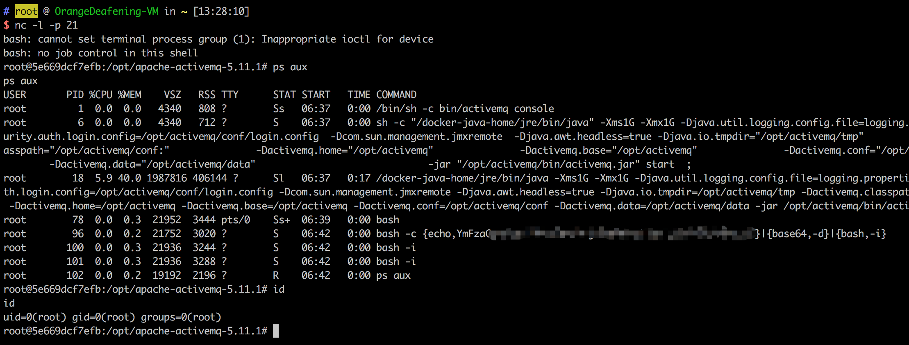

# ActiveMQ Deserialization Vulnerability (CVE-2015-5254)

Apache ActiveMQ é um middleware de mensagens de código aberto desenvolvido pela American Pachitea (Apache) Software Foundation que oferece suporte a serviços de mensagens Java, clustering, estrutura Spring e muito mais.

Apache ActiveMQ versão 5.x antes da vulnerabilidade de segurança 5.13.0, a vulnerabilidade causada pelo programa não limita as classes que podem ser serializadas no proxy. O invasor remoto pode fazer com que um objeto ObjectMessage do Java Message Service (JMS) serializado especial explore essa vulnerabilidade para executar código arbitrário.

Links de referência:

- https://www.blackhat.com/docs/us-16/materials/us-16-Kaiser-Pwning-Your-Java-Messaging-With-Deserialization-Vulnerabilities.pdf

## Ambiente de vulnerabilidade

Inicie o ambiente vulnerável:

```
docker-compose up -d
```

Após executar o ambiente, ele estabelecerá duas portas na porta 61616 e 8161. A porta 61616 é a porta de trabalho e as mensagens são entregues nesta porta. A porta 8161 é a porta da página de gerenciamento de página da Web. Acesse `http://your-ip:8161`, Você pode ver a página de gerenciamento de rede, mas essa vulnerabilidade não requer uma rede teoricamente.

## Explorando

O processo de exploração é o seguinte:

1. Gere a payload serializada (você pode usar ysoserial)
2. Enviar payload para a porta 61616
3. Acesse a página de gerenciamento da web e leia as mensagens de serialização, então você pode acionar a vulnerabilidade.

Para explorar este ambiente, usaremos [jmet](https://github.com/matthiaskaiser/jmet) (Java Message Exploitation Tool). Primeiro baixe o arquivo jar do jmet, e crie a pasta chamada **external** no mesmo diretório (caso contrário pode ocorrer o erro da pasta não existir).

o jmet é para usar o ysoserial para gerar o Payload e enviá-lo (o jar vem com o ysoserial, não precisamos baixá-lo novamente), então precisamos escolher um que possa ser usado no ysoserial como o gadget, como ROME.

Execute:

```
java -jar jmet-0.1.0-all.jar -Q event -I ActiveMQ -s -Y "touch /tmp/success" -Yp ROME your-ip 61616
```


Neste ponto, uma fila chamada event será adicionada ao ActiveMQ de destino.

Você pode visitar `http://your-ip:8161/admin/browse.jsp?JMSDestination=Event` para ver todas as mensagens nesta fila.

(**login / password:** admin/admin):


Clique nesta mensagem para acionar o comando execute, desta vez no container `docker-compose exec activemq bash`,

podemos ver que /tmp/success foi criado com sucesso, indicando que a exploração foi bem-sucedida:


Substitua o comando por uma instrução shell reversa e reutilize-o:



Vale a pena notar que acessar mensagens pela página de administração da Web e acionar a vulnerabilidade requer privilégios de administrador. Na ausência de senha, podemos induzir o administrador a visitar nosso link para acionar, ou mensagens legítimas disfarçadas de outros serviços precisam aguardar o acesso do cliente quando acionadas.
