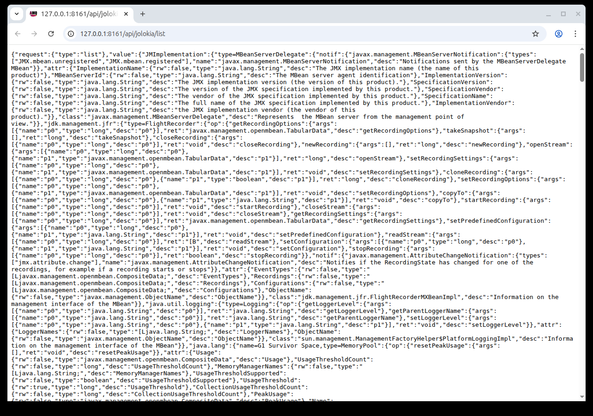
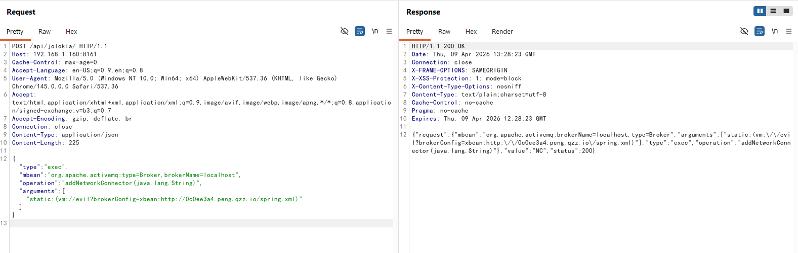
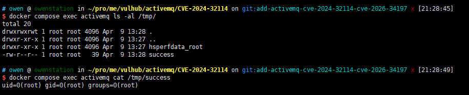

# Apache ActiveMQ Jolokia API未授权访问漏洞（CVE-2024-32114）

[Apache ActiveMQ](https://activemq.apache.org/)是Apache软件基金会开发的一款开源消息中间件，支持Java消息服务（JMS）、集群、Spring框架集成等功能。

CVE-2024-32114是Apache ActiveMQ 6.x在6.1.2版本之前存在的一个漏洞，其默认配置未对API Web上下文进行安全防护。Jolokia JMX REST API和Message REST API分别位于`/api/jolokia`和`/api/message`，均无需任何身份认证即可访问。未经认证的攻击者可以通过这些API与消息代理进行交互，包括管理消息、清空队列以及调用任意MBean操作。结合[CVE-2026-34197](../CVE-2026-34197/)，可以在ActiveMQ 6.0.0至6.1.1版本上实现未授权远程代码执行。

参考链接：

- <https://activemq.apache.org/security-advisories.data/CVE-2024-32114-announcement.txt>
- <https://nvd.nist.gov/vuln/detail/CVE-2024-32114>

## 环境搭建

执行如下命令启动Apache ActiveMQ 6.1.1：

```
docker compose up -d
```

服务启动后，访问`http://your-ip:8161`即可看到ActiveMQ Web控制台。控制台本身需要凭据（`admin:admin`），但`/api/`下的API接口无需任何认证即可访问。

## 漏洞复现

直接访问Jolokia API即可验证该漏洞，无需提供任何凭据。发送如下请求列出所有可用的MBeans：

```
GET /api/jolokia/list HTTP/1.1
Host: your-ip:8161
```

服务器会返回一个包含所有已注册MBeans的JSON响应，证明Jolokia API无需认证即可访问：



将该漏洞与[CVE-2026-34197](../CVE-2026-34197/)组合利用，未经认证的攻击者可以实现预认证远程代码执行。利用细节请参考CVE-2026-34197的文档。以下演示通过未授权的Jolokia API调用Broker MBean的`addNetworkConnector`操作执行任意代码：



验证命令执行成功：


