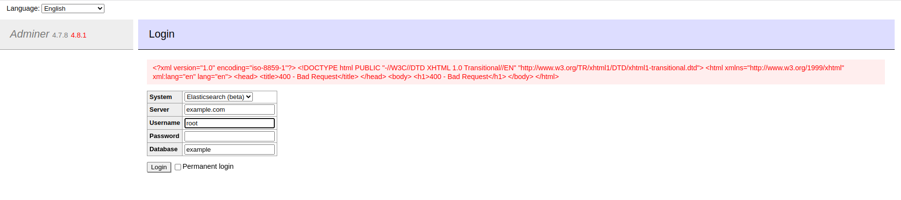

# Adminer Server-side Request Forgery on Error Page of Elasticsearch and ClickHouse (CVE-2021-21311)

[中文版本(Chinese version)](README.zh-cn.md)

Adminer is a tool for managing content in databases developed by PHP. It natively supports MySQL, MariaDB, PostgreSQL, SQLite, MS SQL, Oracle, Elasticsearch and MongoDB.

In adminer from version 4.0.0 and before 4.7.9 there is a server-side request forgery vulnerability on error page of Elasticsearch and ClickHouse. Users of Adminer versions bundling all drivers (e.g. `adminer.php`) are affected. This is fixed in version 4.7.9.

References:

- <https://github.com/vrana/adminer/security/advisories/GHSA-x5r2-hj5c-8jx6>
- <https://github.com/vrana/adminer/files/5957311/Adminer.SSRF.pdf>
- <https://github.com/projectdiscovery/nuclei-templates/blob/main/http/cves/2021/CVE-2021-21311.yaml>

## Vulnerable environment

Execute following command to start a PHP server with Adminer 4.7.8:

```
docker compose up -d
```

After the server is started, you can see the login page of Adminer at `http://your-ip:8080`.

## Exploit

Select the ElasticSearch as the system field, then input `example.com` into the server field. Click the login button, you will see the 400 response from `example.com`:


