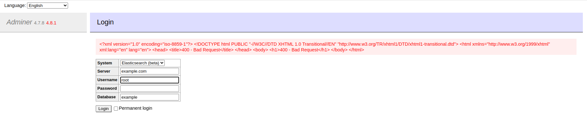

# Adminer ElasticSearch 和 ClickHouse 错误页面 SSRF 漏洞（CVE-2021-21311）

Adminer 是一个 PHP 编写的开源数据库管理工具，支持 MySQL、MariaDB、PostgreSQL、SQLite、MS SQL、Oracle、Elasticsearch、MongoDB 等数据库。

在其 4.0.0 到 4.7.9 版本之间，连接 ElasticSearch 和 ClickHouse 数据库时存在一处服务端请求伪造漏洞（SSRF）。

参考连接：

- <https://github.com/vrana/adminer/security/advisories/GHSA-x5r2-hj5c-8jx6>
- <https://github.com/vrana/adminer/files/5957311/Adminer.SSRF.pdf>
- <https://github.com/projectdiscovery/nuclei-templates/blob/main/http/cves/2021/CVE-2021-21311.yaml>

## 漏洞环境

执行如下命令启动一个安装了 Adminer 4.7.8 的 PHP 服务：

```
docker compose up -d
```

服务启动后，在 `http://your-ip:8080` 即可查看到 Adminer 的登录页面。

## 漏洞复现

在 Adminer 登录页面，选择 ElasticSearch 作为系统目标，并在 server 字段填写 `example.com`，点击登录即可看到 `example.com` 返回的 400 错误页面展示在页面中：


