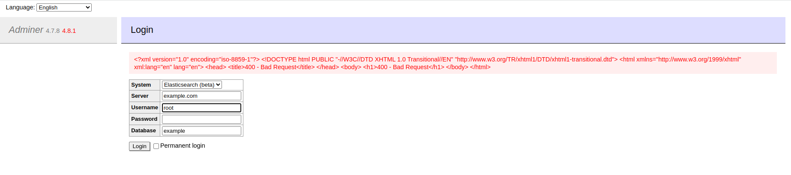

# Adminer ElasticSearch 和 ClickHouse 错误页面SSRF漏洞（CVE-2021-21311）

Adminer是一个PHP编写的开源数据库管理工具，支持MySQL、MariaDB、PostgreSQL、SQLite、MS SQL、Oracle、Elasticsearch、MongoDB等数据库。

在其4.0.0到4.7.9版本之间，连接 ElasticSearch 和 ClickHouse 数据库时存在一处服务端请求伪造漏洞（SSRF）。

参考连接：

- <https://github.com/vrana/adminer/security/advisories/GHSA-x5r2-hj5c-8jx6>
- <https://github.com/vrana/adminer/files/5957311/Adminer.SSRF.pdf>
- <https://github.com/projectdiscovery/nuclei-templates/blob/main/http/cves/2021/CVE-2021-21311.yaml>

## 漏洞环境

执行如下命令启动一个安装了Adminer 4.7.8的PHP服务：

```
docker compose up -d
```

服务启动后，在`http://your-ip:8080`即可查看到Adminer的登录页面。

## 漏洞复现

在Adminer登录页面，选择ElasticSearch作为系统目标，并在server字段填写`example.com`，点击登录即可看到`example.com`返回的400错误页面展示在页面中：


