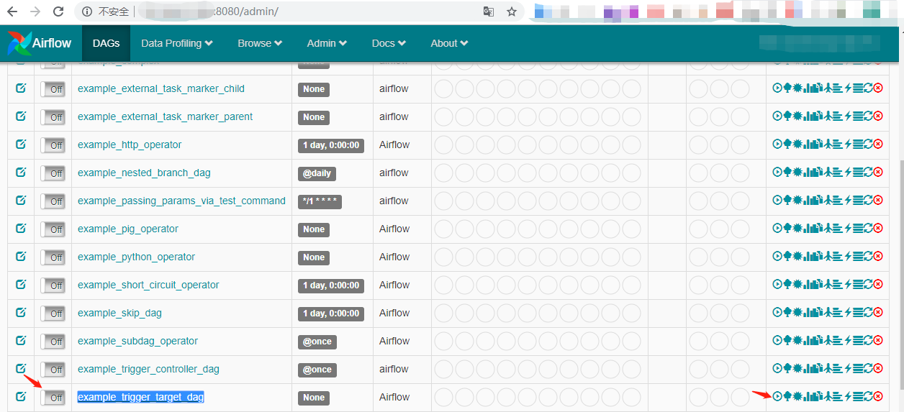
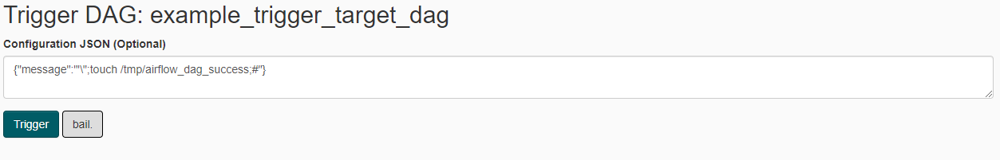
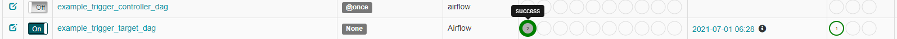
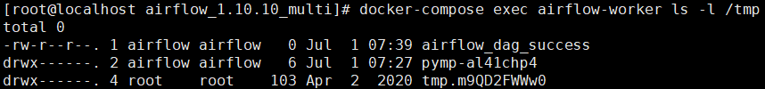

# Apache Airflow 示例dag中的命令注入（CVE-2020-11978）

Apache Airflow是一款开源的，分布式任务调度框架。在其1.10.10版本及以前的示例DAG中存在一处命令注入漏洞，未授权的访问者可以通过这个漏洞在Worker中执行任意命令。

由于启动的组件比较多，可能会有点卡，运行此环境可能需要准备2G以上的内存。

参考链接：

- <https://lists.apache.org/thread/cn57zwylxsnzjyjztwqxpmly0x9q5ljx>
- <https://github.com/pberba/CVE-2020-11978>

## 漏洞环境

依次执行如下命令启动airflow 1.10.10：

```bash
#初始化数据库
docker-compose run airflow-init

#启动服务
docker-compose up -d
```

## 漏洞复现

访问`http://your-ip:8080`进入airflow管理端，将`example_trigger_target_dag`前面的Off改为On：



再点击执行按钮，在Configuration JSON中输入：`{"message":"'\";touch /tmp/airflow_dag_success;#"}`，再点`Trigger`执行dag：



等几秒可以看到执行成功：



到CeleryWorker容器中进行查看：

```bash
docker-compose exec airflow-worker ls -l /tmp
```

可以看到`touch /tmp/airflow_dag_success`成功被执行：


