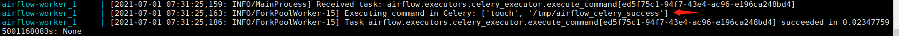

# Apache Airflow Celery Broker Remote Command Execution (CVE-2020-11981)

[中文版本(Chinese version)](README.zh-cn.md)

Apache Airflow is an open source, distributed task scheduling framework. In the version prior to 1.10.10, if the Redis broker (such as Redis or RabbitMQ) has been controlled by attacker, the attacker can execute arbitrary commands in the worker process.

Since there are many components to be started, it may be a bit stuck. Please prepare more than 2G of memory for the use of the virtual machine.

References:

- <https://lists.apache.org/thread/cn57zwylxsnzjyjztwqxpmly0x9q5ljx>
- <https://github.com/apache/airflow/pull/9178>

## Vulnerability Environment

Execute the following commands to start an airflow 1.10.10 server:

```bash
#Initialize the database
docker-compose run airflow-init

#Start service
docker-compose up -d
```

## Exploit

For exploit this vulnerability, you have to get the write permission of the Celery broker, Redis. In Vulhub environment, Redis port 6379 is exposing on the Internet.

Through the Redis, you can add the evil task `airflow.executors.celery_executor.execute_command` to the queue to execute arbitrary commands.

Use this script [exploit_airflow_celery.py](exploit_airflow_celery.py) to execute the command `touch /tmp/airflow_celery_success`

```
pip install redis
python exploit_airflow_celery.py [your-ip]
```

See the results on the logs:

```bash
docker-compose logs airflow-worker
```



As you can see, `touch /tmp/airflow_celery_success` has been successfully executed:

```
docker-compose exec airflow-worker ls -l /tmp
```


