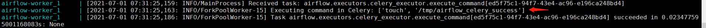
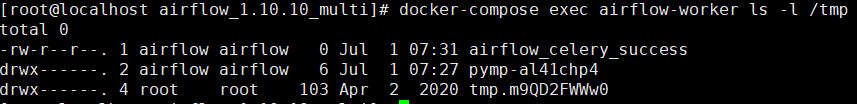

# Apache Airflow Celery 消息中间件命令执行（CVE-2020-11981）

Apache Airflow是一款开源的，分布式任务调度框架。在其1.10.10版本及以前，如果攻击者控制了Celery的消息中间件（如Redis/RabbitMQ），将可以通过控制消息，在Worker进程中执行任意命令。

由于启动的组件比较多，可能会有点卡，运行此环境可能需要准备2G以上的内存。

参考链接：

- <https://lists.apache.org/thread/cn57zwylxsnzjyjztwqxpmly0x9q5ljx>
- <https://github.com/apache/airflow/pull/9178>

## 漏洞环境

依次执行如下命令启动airflow 1.10.10

```bash
#初始化数据库
docker-compose run airflow-init

#启动服务
docker-compose up -d
```

## 漏洞利用

利用这个漏洞需要控制消息中间件，Vulhub环境中Redis存在未授权访问。通过未授权访问，攻击者可以下发自带的任务`airflow.executors.celery_executor.execute_command`来执行任意命令，参数为命令执行中所需要的数组。

我们可以使用[exploit_airflow_celery.py](exploit_airflow_celery.py)这个小脚本来执行命令`touch /tmp/airflow_celery_success`：

```bash
pip install redis
python exploit_airflow_celery.py [your-ip]
```

查看结果：

```bash
docker-compose logs airflow-worker
```

可以看到如下任务消息：



```bash
docker-compose exec airflow-worker ls -l /tmp
```

可以看到成功创建了文件`airflow_celery_success`：


