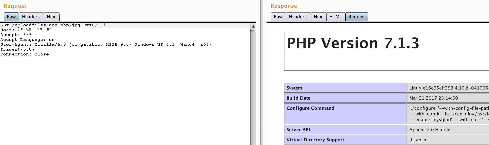

# Apache 解析漏洞复现环境

该环境版本：

- PHP 7.x 最新版
- Apache 2.4.10 稳定版（来自debian源）

由此可知，该漏洞与Apache、php版本无关，属于用户配置不当造成的解析漏洞。

直接执行`docker-compose up -d`启动容器，无需编译。启动后访问`http://your-ip/uploadfiles/apache.php.jpeg`即可发现，phpinfo被执行了，该文件被解析为php脚本。

`http://your-ip/index.php`中是一个白名单检查文件后缀的上传组件，上传完成后并未重命名。我们可以通过上传文件名为`xxx.php.jpg`或`xxx.php.jpeg`的文件，利用Apache解析漏洞进行getshell。

