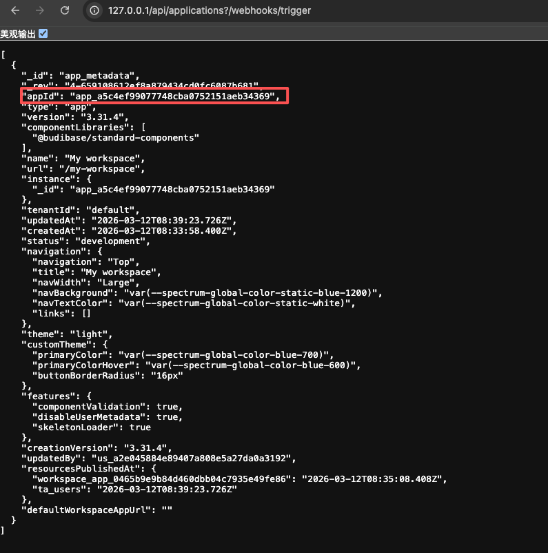
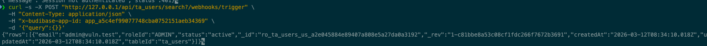
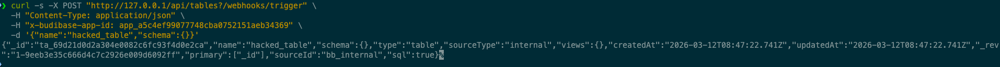

# Budibase Authentication Bypass via Webhook Query Parameter (CVE-2026-31816)

[中文版本(Chinese version)](README.zh-cn.md)

Budibase is a low-code platform for creating internal tools, workflows, and admin panels.

CVE-2026-31816 is a critical authentication bypass vulnerability affecting Budibase versions 3.31.4 and earlier. The vulnerability stems from a flawed implementation in the `authorized()` middleware that protects all server-side API endpoints. The `isWebhookEndpoint()` function uses an unanchored regular expression to test against `ctx.request.url`, which in Koa includes the full URL with query parameters. When the regex matches, the `authorized()` middleware immediately returns `next()`, completely bypassing authentication, authorization, role checks, and CSRF protection. An unauthenticated remote attacker can access any server-side API endpoint by simply appending `?/webhooks/trigger` or any webhook path pattern variant to the URL.

References:

- <https://github.com/Budibase/budibase/security/advisories/GHSA-gw94-hprh-4wj8>
- <https://nvd.nist.gov/vuln/detail/CVE-2026-31816>

## Environment Setup

Execute the following command to start Budibase v3.31.4:

```
docker compose up -d
```

After the server starts, visit `http://your-ip:80` to access the Budibase interface. The default administrator credentials are `admin@vuln.test:admin123456`.

After logging into the system using the default credentials, a workspace is created.

## Vulnerability Reproduction

The vulnerability can be exploited by appending a webhook path pattern such as `?/webhooks/trigger` to any API endpoint URL. This causes the `isWebhookEndpoint()` function to match the query string, triggering the authentication bypass. First, you need to obtain a valid app ID by accessing the Budibase instance. Then you can access protected API endpoints without any authentication by simply adding the webhook pattern to the query string.

First, send a request to list all applications without any authentication to discover available app IDs:

```
GET /api/applications?/webhooks/trigger HTTP/1.1
Host: your-ip:80
Accept: application/json
```

The server will return a list of applications with their IDs, even though no authentication credentials were provided. This is the baseline behavior demonstrating the authentication bypass. Copy one of the app IDs from the response, which will be used in subsequent requests.



Once you have a valid app ID, you can access sensitive API endpoints. For example, send a request to list all user data without authentication:

```
POST /api/ta_users/search?/webhooks/trigger HTTP/1.1
Host: your-ip:80
Content-Type: application/json
x-budibase-app-id: <TARGETED_APP_ID>

{"query":{}}
```

The response will contain all user records including email addresses and roles, demonstrating complete data exfiltration capability. This request would normally require authentication and return a 302 redirect to the login page, but due to the authentication bypass, it returns the sensitive user data directly.



You can also create, modify, or delete data. Send a request to create a new table without authentication:

```
POST /api/tables?/webhooks/trigger HTTP/1.1
Host: your-ip:80
Content-Type: application/json
x-budibase-app-id: <TARGETED_APP_ID>

{"name":"hacked_table","schema":{}}
```

The server will respond with HTTP 200 and return the newly created table ID and revision, confirming that arbitrary data manipulation is possible without authentication. This demonstrates that the vulnerability provides full CRUD access to all application resources including tables, rows, automations, datasources, queries, views, and plugins.


