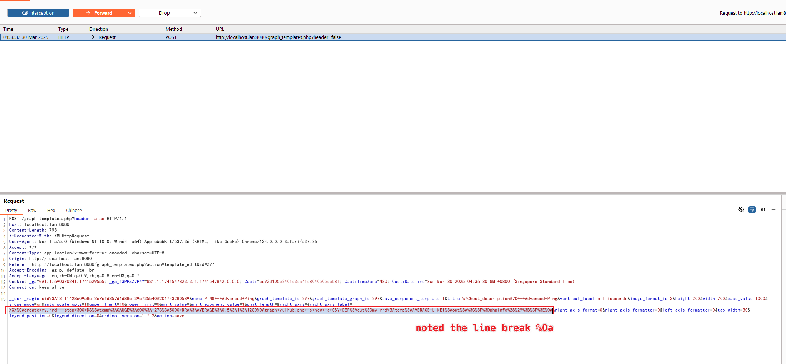
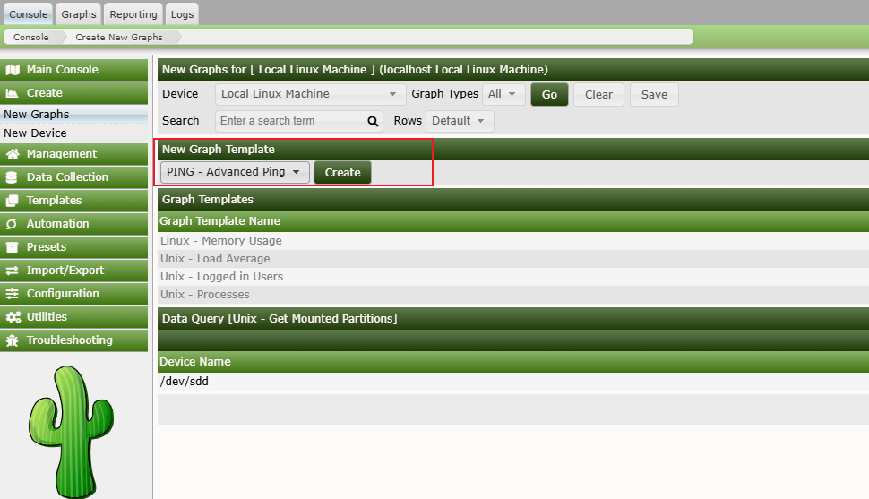
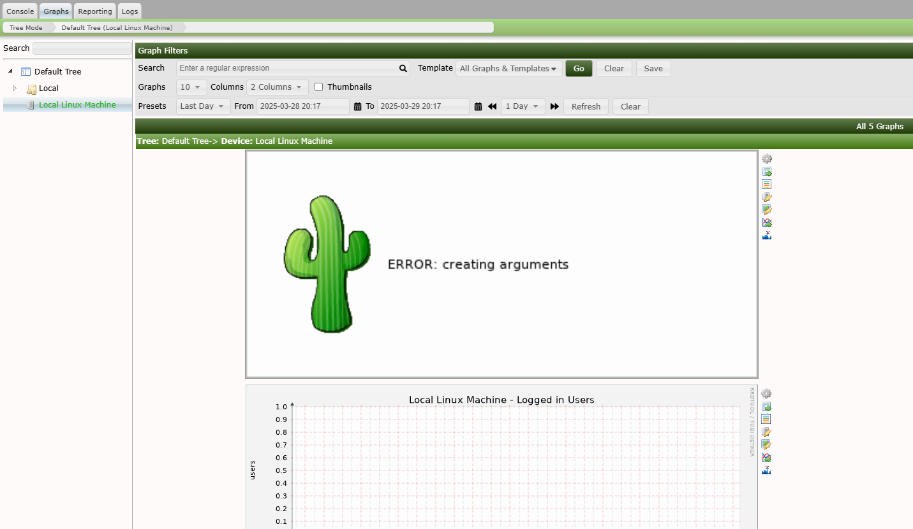
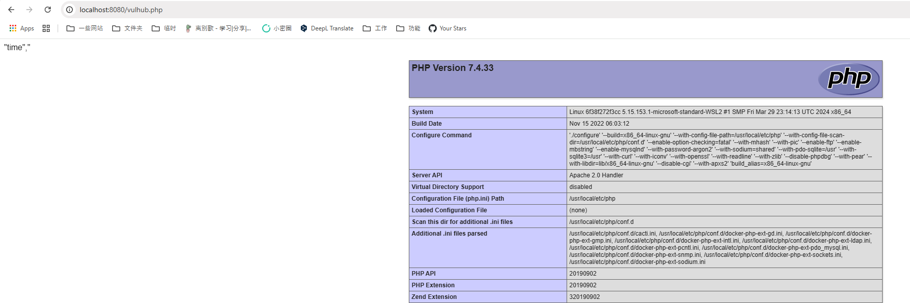

# Cacti RRDTool 后台参数注入导致远程代码执行 (CVE-2025-24367)

Cacti 是一款利用 RRDTool 数据存储和图形化功能的完整网络图形化解决方案。在 Cacti 1.2.28 及以前版本中存在一个命令注入漏洞，该漏洞允许已认证用户在 Web 服务器上创建任意 PHP 文件，从而可能导致远程代码执行。

此漏洞出现在图形模板功能中，用户输入的 RRDTool 命令参数，如 `--right-axis-label`，未被正确过滤。虽然 Cacti 尝试使用 `cacti_escapeshellarg()` 函数转义 shell 元字符，但它未能处理换行符。这允许攻击者突破预期的命令上下文并注入其他 RRDTool 命令，最终能够向 Web 根目录写入恶意 PHP 文件。

参考链接：

- <https://github.com/Cacti/cacti/security/advisories/GHSA-fxrq-fr7h-9rqq>
- <https://github.com/Cacti/cacti/commit/c7e4ee798d263a3209ae6e7ba182c7b65284d8f0>

## 环境搭建

执行如下命令启动 Cacti 1.2.28：

```
docker compose up -d
```

服务启动后，访问 http://your-ip:8080 即可看到 Cacti 的登录界面，默认用户名密码为 admin/admin。

你需要登录并按照初始化指引操作，只需点击"Next"按钮直到看到成功页面即可。

## 漏洞复现

首先，需要登录 Cacti。在 Cacti 控制台，导航至"Console → Templates → Graph"，找到"PING - Advanced Ping"模板并编辑它。捕获这个编辑请求，然后修改 `right_axis_label` 参数为以下 payload（请注意换行符 `%0a`）：

```
XXX
create my.rrd --step 300 DS:temp:GAUGE:600:-273:5000 RRA:AVERAGE:0.5:1:1200
graph vulhub.php -s now -a CSV DEF:out=my.rrd:temp:AVERAGE LINE1:out:<?=phpinfo();?>
```



然后，来到"Console → Create → New Graphs"，使用"PING - Advanced Ping"模板创建一个新图表：



之后，来到"Graphs → Default Tree → Local Linux Machine"来触发 payload 执行。



你会看到一个带有"Error: creating arguments"错误消息的图像，这意味着 payload 已被执行。

命令执行后，payload 将在 Cacti 的 Web 根目录创建两个文件：一个 RRD 文件 (my.rrd) 和一个 PHP 网页 shell(vulhub.php)：


