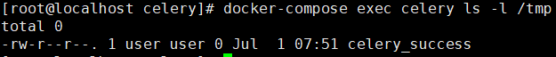

# Celery <4.0 Redis未授权访问+Pickle反序列化利用

Celery 是一个简单、灵活且可靠的分布式系统，用于处理大量消息，同时为操作提供维护此类系统所需的工具。它是一个专注于实时处理的任务队列，同时也支持任务调度。

在Celery < 4.0版本默认使用Pickle进行任务消息的序列化传递，当所用队列服务（比如Redis、RabbitMQ、RocketMQ等等等）存在未授权访问问题时，可利用Pickle反序列化漏洞执行任意代码。

## 漏洞环境

执行如下命令启动Celery 3.1.23 + Redis：

```bash
docker-compose up -d
```

## 漏洞复现

漏洞利用脚本`exploit.py`仅支持在python3下使用

```bash
pip install redis
python exploit.py [主机IP]
```

查看结果：

```
docker-compose logs celery
```

可以看到如下任务消息报错：


```bash
docker-compose exec celery ls -l /tmp
```

可以看到成功创建了文件`celery_success`



## 参考

https://docs.celeryproject.org/en/stable/userguide/configuration.html

https://www.bookstack.cn/read/celery-3.1.7-zh/8d5b10e3439dbe1f.md#dhfmrk

https://docs.celeryproject.org/en/stable/userguide/calling.html#serializers

https://www.jianshu.com/p/52552c075bc0

https://www.runoob.com/w3cnote/python-redis-intro.html

https://blog.csdn.net/SKI_12/article/details/85015803
